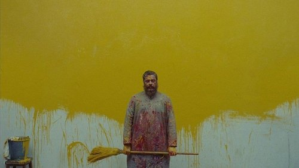



<nav class="films">
  <a class="prev" href="../sweetheart-2021">Previous</a>
  <a href="../">Film list</a>
  <a class="next" href="../the-power-of-the-dog-2021">Next</a>
</nav>

85 / 100

<article class="film">
  

    
    
  

  <h1>The French Dispatch ({{ film | filmYear }})</h1>

  

  

    Directed by <strong>{{ film | directors }}</strong>
  

  <h2>
    Cast
  </h2>
  <ul>
            <li><strong>Benicio del Toro</strong> as <em>Moses Rosenthaler</em></li>
        <li><strong>Adrien Brody</strong> as <em>Julian Cadazio</em></li>
        <li><strong>Tilda Swinton</strong> as <em>J.K.L. Berensen</em></li>
        <li><strong>Léa Seydoux</strong> as <em>Simone</em></li>
        <li><strong>Frances McDormand</strong> as <em>Lucinda Krementz</em></li>
        <li><strong>Timothée Chalamet</strong> as <em>Zeffirelli</em></li>
        <li><strong>Lyna Khoudri</strong> as <em>Juliette</em></li>
        <li><strong>Jeffrey Wright</strong> as <em>Roebuck Wright</em></li>
        <li><strong>Mathieu Amalric</strong> as <em>The Commissaire</em></li>
        <li><strong>Steve Park</strong> as <em>Nescaffier</em></li>
        <li><strong>Bill Murray</strong> as <em>Arthur Howitzer, Jr.</em></li>
        <li><strong>Owen Wilson</strong> as <em>Herbsaint Sazerac</em></li>
        <li><strong>Bob Balaban</strong> as <em>Uncle Nick</em></li>
        <li><strong>Henry Winkler</strong> as <em>Uncle Joe</em></li>
        <li><strong>Lois Smith</strong> as <em>Upshur 'Maw' Clampette</em></li>
        <li><strong>Tony Revolori</strong> as <em>Young Rosenthaler</em></li>
        <li><strong>Denis Ménochet</strong> as <em>Prison Guard</em></li>
        <li><strong>Larry Pine</strong> as <em>Chief Magistrate</em></li>
        <li><strong>Morgane Polanski</strong> as <em>Girlfriend</em></li>
        <li><strong>Félix Moati</strong> as <em>Head Caterer</em></li>
        <li><strong>Mohamed Belhadjine</strong> as <em>Mitch-Mitch</em></li>
        <li><strong>Nicolas Avinée</strong> as <em>Vittel</em></li>
        <li><strong>Christoph Waltz</strong> as <em>Paul Duval</em></li>
        <li><strong>Cécile de France</strong> as <em>Mrs. B</em></li>
        <li><strong>Guillaume Gallienne</strong> as <em>Mr. B</em></li>
        <li><strong>Rupert Friend</strong> as <em>Drill-Sergeant</em></li>
        <li><strong>Alex Lawther</strong> as <em>Morisot</em></li>
        <li><strong>Tom Hudson</strong> as <em>Mitch-Mitch (on stage)</em></li>
        <li><strong>Lily Taïeb</strong> as <em>Juliette's Friend</em></li>
        <li><strong>Stéphane Bak</strong> as <em>Communications Specialist</em></li>
        <li><strong>Hippolyte Girardot</strong> as <em>Chou-fleur</em></li>
        <li><strong>Liev Schreiber</strong> as <em>Talk Show Host</em></li>
        <li><strong>Willem Dafoe</strong> as <em>Albert 'the Abacus'</em></li>
        <li><strong>Edward Norton</strong> as <em>The Chauffeur</em></li>
        <li><strong>Saoirse Ronan</strong> as <em>Junkie / Showgirl #1</em></li>
        <li><strong>Winsen Ait Hellal</strong> as <em>Gigi</em></li>
        <li><strong>Mauricette Coudivat</strong> as <em>Maman</em></li>
        <li><strong>Damien Bonnard</strong> as <em>Police Detective</em></li>
        <li><strong>Rodolphe Pauly</strong> as <em>Patrolman Maupassant</em></li>
        <li><strong>Antonia Desplat</strong> as <em>Junkie / Showgirl #2</em></li>
        <li><strong>Elisabeth Moss</strong> as <em>Alumna</em></li>
        <li><strong>Jason Schwartzman</strong> as <em>Hermès Jones</em></li>
        <li><strong>Fisher Stevens</strong> as <em>Story Editor</em></li>
        <li><strong>Griffin Dunne</strong> as <em>Legal Advisor</em></li>
        <li><strong>Pablo Pauly</strong> as <em>Waiter</em></li>
        <li><strong>Wallace Wolodarsky</strong> as <em>Cheery Writer</em></li>
        <li><strong>Anjelica Bette Fellini</strong> as <em>Proofreader</em></li>
        <li><strong>Anjelica Huston</strong> as <em>Narrator (voice)</em></li>
        <li><strong>Krishna Bagadiya</strong> as <em>Blind Writer</em></li>
        <li><strong>Julien Lecat</strong> as <em>Amanuensis</em></li>
        <li><strong>Gaelle Puimaly</strong> as <em>Accountant</em></li>
        <li><strong>Leo Jennings</strong> as <em>Copy Boy</em></li>
        <li><strong>Alexandre Steiger</strong> as <em>Howitzer's Doctor</em></li>
        <li><strong>Philippe Peyraud</strong> as <em>Man Smoking Cigarette</em></li>
        <li><strong>Gérard Merle</strong> as <em>Man Outside Café</em></li>
        <li><strong>Jean Pierre Grasset</strong> as <em>Weathered Man with Hat</em></li>
        <li><strong>Yannick Begoin</strong> as <em>Magazine Delivery Man</em></li>
        <li><strong>Yves Gaillard</strong> as <em>Old Man at Wine Shop</em></li>
        <li><strong>Jerome Caminotti</strong> as <em>Old Man at Metro Map</em></li>
        <li><strong>Pierre-Yves Martron</strong> as <em>Police Cyclist</em></li>
        <li><strong>Philippe Pelletier</strong> as <em>Police Cyclist / Police</em></li>
        <li><strong>Landry Marinette</strong> as <em>Woman Rolling Groceries</em></li>
        <li><strong>Natal Koli</strong> as <em>Kansas Gravedigger</em></li>
        <li><strong>Côme Loury</strong> as <em>Bootblack</em></li>
        <li><strong>Victor Piechaud</strong> as <em>Bootblack</em></li>
        <li><strong>Charlie Rosser</strong> as <em>Bootblack</em></li>
        <li><strong>Mathys Raynaud</strong> as <em>Bootblack</em></li>
        <li><strong>Thomas Poirson</strong> as <em>Bootblack</em></li>
        <li><strong>Gabriel Mesnard</strong> as <em>Bootblack</em></li>
        <li><strong>Raphael Delage</strong> as <em>Bootblack</em></li>
        <li><strong>Briac Aubin</strong> as <em>Bootblack</em></li>
        <li><strong>Raphael Bancarel</strong> as <em>Bootblack</em></li>
        <li><strong>Tiago Allaire</strong> as <em>Bootblack</em></li>
        <li><strong>Martin Frappier</strong> as <em>Bootblack</em></li>
        <li><strong>Raphael Dias</strong> as <em>Bootblack</em></li>
        <li><strong>Victorien Belly</strong> as <em>Bootblack</em></li>
        <li><strong>Samuel Amblard</strong> as <em>Bootblack</em></li>
        <li><strong>Sam Poupart</strong> as <em>Bootblack</em></li>
        <li><strong>Milo Bancarel</strong> as <em>Bootblack</em></li>
        <li><strong>Charles Audry</strong> as <em>Bootblack Customer</em></li>
        <li><strong>Francois Boussiron</strong> as <em>Bootblack Customer</em></li>
        <li><strong>Jean-Pierre Coudert</strong> as <em>Bootblack Customer</em></li>
        <li><strong>Patrick Morcelli</strong> as <em>Bootblack Customer</em></li>
        <li><strong>Bernard Richefort</strong> as <em>Bootblack Customer</em></li>
        <li><strong>Djemal Saidoun</strong> as <em>Bootblack Customer</em></li>
        <li><strong>Vincent Griere</strong> as <em>Bricklayer</em></li>
        <li><strong>Arthur Guillebaud</strong> as <em>Bricklayer</em></li>
        <li><strong>Mehdy Hassani</strong> as <em>Bricklayer</em></li>
        <li><strong>Jérémy Martincourt</strong> as <em>Bricklayer</em></li>
        <li><strong>Nicolas Pasciani</strong> as <em>Bricklayer</em></li>
        <li><strong>Eutrope Roger</strong> as <em>Bricklayer</em></li>
        <li><strong>Marti Torrens</strong> as <em>Bricklayer</em></li>
        <li><strong>Pierre Cantaral</strong> as <em>Pickpocket</em></li>
        <li><strong>Louis Changeur</strong> as <em>Pickpocket</em></li>
        <li><strong>Denis Havard</strong> as <em>Pickpocket</em></li>
        <li><strong>Halbo Kool</strong> as <em>Pickpocket</em></li>
        <li><strong>Pascal Lefort</strong> as <em>Pickpocket</em></li>
        <li><strong>Jean-Benoit Pinot</strong> as <em>Pickpocket</em></li>
        <li><strong>Gregory Sacriste</strong> as <em>Pickpocket</em></li>
        <li><strong>Antonio Terroso</strong> as <em>Pickpocket</em></li>
        <li><strong>Marc Tournier</strong> as <em>Pickpocket</em></li>
        <li><strong>Jean Marie Camps</strong> as <em>Butcher</em></li>
        <li><strong>Dominique Donnary</strong> as <em>Butcher</em></li>
        <li><strong>Claude Gaume</strong> as <em>Butcher</em></li>
        <li><strong>Jacques Grattepanch</strong> as <em>Butcher</em></li>
        <li><strong>Damien Nadaud</strong> as <em>Butcher</em></li>
        <li><strong>Gilbert Papponnaud</strong> as <em>Butcher</em></li>
        <li><strong>Robert Rabouin</strong> as <em>Butcher</em></li>
        <li><strong>Willem Rompen</strong> as <em>Butcher</em></li>
        <li><strong>Jacky Souchet</strong> as <em>Butcher</em></li>
        <li><strong>Malik Tati</strong> as <em>Butcher</em></li>
        <li><strong>Jean-Claude Audouin</strong> as <em>Man Shining Shoe</em></li>
        <li><strong>Alban Ploix</strong> as <em>Ticket Vendor</em></li>
        <li><strong>Laurent Bauer</strong> as <em>'Brique Rouge' Clubgoer</em></li>
        <li><strong>Fanny Taccoen</strong> as <em>'Brique Rouge' Clubgoer</em></li>
        <li><strong>Tahnee Peterson Stuart</strong> as <em>'Brique Rouge' Clubgoer</em></li>
        <li><strong>Maud Brethenoux</strong> as <em>'Brique Rouge' Clubgoer</em></li>
        <li><strong>Anna Budanova</strong> as <em>'Brique Rouge' Clubgoer</em></li>
        <li><strong>Audrey Chemin</strong> as <em>'Brique Rouge' Clubgoer</em></li>
        <li><strong>Guillaume Ferrant</strong> as <em>'Brique Rouge' Clubgoer</em></li>
        <li><strong>Nisrine Mofaraj</strong> as <em>'Brique Rouge' Clubgoer</em></li>
        <li><strong>Polina Glangetat</strong> as <em>Old Lady with Punks</em></li>
        <li><strong>Fabien Marcadet</strong> as <em>Punk</em></li>
        <li><strong>Luc Louis</strong> as <em>Punk</em></li>
        <li><strong>Karim Youssouf</strong> as <em>Punk</em></li>
        <li><strong>Rudy Chaperon</strong> as <em>Punk</em></li>
        <li><strong>Quentin Fournier</strong> as <em>Punk</em></li>
        <li><strong>Orguiene Corniere</strong> as <em>Punk</em></li>
        <li><strong>Manon Talandier</strong> as <em>Punk</em></li>
        <li><strong>Lucas Bascans</strong> as <em>Punk</em></li>
        <li><strong>Alexis Vignaud</strong> as <em>Punk</em></li>
        <li><strong>Paul Raymond</strong> as <em>Punk</em></li>
        <li><strong>Gilles Gauthier</strong> as <em>Man with Camera</em></li>
        <li><strong>Nahel Bahnas</strong> as <em>Choirboy</em></li>
        <li><strong>Akim Bahnas</strong> as <em>Choirboy</em></li>
        <li><strong>Antoine Foo Cheung</strong> as <em>Choirboy</em></li>
        <li><strong>Francois Foo Cheung</strong> as <em>Choirboy</em></li>
        <li><strong>Samy Guerry Ghindri</strong> as <em>Choirboy</em></li>
        <li><strong>Felicien Marais</strong> as <em>Choirboy</em></li>
        <li><strong>Nathanael Marfin</strong> as <em>Choirboy</em></li>
        <li><strong>Basile Vinueas</strong> as <em>Choirboy</em></li>
        <li><strong>Evelyne Chapeau</strong> as <em>Old Lady with Choirboys</em></li>
        <li><strong>Paula Kvasnikoff</strong> as <em>Kissing Student</em></li>
        <li><strong>Vallier Vaudin</strong> as <em>Kissing Student</em></li>
        <li><strong>André Coussy</strong> as <em>Old Man Who Has Failed</em></li>
        <li><strong>Hassane Haimoud</strong> as <em>Boy Scout</em></li>
        <li><strong>Pauline Chadanson</strong> as <em>Streetwalker</em></li>
        <li><strong>Carlotta Costanzi</strong> as <em>Streetwalker</em></li>
        <li><strong>Mauricette Genon</strong> as <em>Streetwalker</em></li>
        <li><strong>Christelle Grelier</strong> as <em>Streetwalker</em></li>
        <li><strong>Rachel Merabet Hrdy</strong> as <em>Streetwalker</em></li>
        <li><strong>Sara Lacroix</strong> as <em>Streetwalker</em></li>
        <li><strong>Delphine Landrieau</strong> as <em>Streetwalker</em></li>
        <li><strong>Louise Laveuve</strong> as <em>Streetwalker</em></li>
        <li><strong>Kylian Freslon</strong> as <em>Gigolo</em></li>
        <li><strong>Meermout Didier</strong> as <em>John in Car</em></li>
        <li><strong>Nicolas Saada</strong> as <em>Lawyer</em></li>
        <li><strong>Yannik Mazzilli</strong> as <em>Bartender</em></li>
        <li><strong>Guillaume Mailland</strong> as <em>Representative Prisoner</em></li>
        <li><strong>Victor Nicolas</strong> as <em>Butcher Boy</em></li>
        <li><strong>Jean Delabre</strong> as <em>Cruel Man in Tavern</em></li>
        <li><strong>François-Pierre Fol</strong> as <em>Vivaldi Trio</em></li>
        <li><strong>Bruno Torres</strong> as <em>Vivaldi Trio</em></li>
        <li><strong>Jean-Louis Verdier</strong> as <em>Vivaldi Trio</em></li>
        <li><strong>Grégory Trouvé</strong> as <em>Caterer</em></li>
        <li><strong>Loic Baxas</strong> as <em>'Maw' Clampette's Doctor</em></li>
        <li><strong>Eliel Ford</strong> as <em>Cadazio's Nephew</em></li>
        <li><strong>Mathéo Sallat Desvard</strong> as <em>Cadazio's Nephew</em></li>
        <li><strong>Dominique Barrier</strong> as <em>Magistrate</em></li>
        <li><strong>Pascal Champareau</strong> as <em>Magistrate</em></li>
        <li><strong>Sacha Seguin</strong> as <em>Maid</em></li>
        <li><strong>Jacky Vallantin</strong> as <em>Foreign Legion Officer</em></li>
        <li><strong>Domingos Enrico</strong> as <em>Rosenthaler Father</em></li>
        <li><strong>Abdel Nour Bouaza</strong> as <em>Rosenthaler Son</em></li>
        <li><strong>Fanny Rebuffic</strong> as <em>Simone at Six</em></li>
        <li><strong>Juliette Raffray</strong> as <em>Simone at Twelve</em></li>
        <li><strong>Lou Lampros</strong> as <em>Simone at Sixteen</em></li>
        <li><strong>Odile Fougère</strong> as <em>Simone at Forty</em></li>
        <li><strong>Sandro Kopp</strong> as <em>The French Splatter-School Action-Group</em></li>
        <li><strong>Pedro Firmino Cunha Da Souza</strong> as <em>The French Splatter-School Action-Group</em></li>
        <li><strong>Pascal Battelier</strong> as <em>The French Splatter-School Action-Group</em></li>
        <li><strong>Lionel Lassuderie</strong> as <em>The French Splatter-School Action-Group</em></li>
        <li><strong>Duc Minh</strong> as <em>The French Splatter-School Action-Group</em></li>
        <li><strong>Cyril Morandiere</strong> as <em>The French Splatter-School Action-Group</em></li>
        <li><strong>Benoit Nacaud</strong> as <em>The French Splatter-School Action-Group</em></li>
        <li><strong>Jean Jacques Peyraud</strong> as <em>The French Splatter-School Action-Group</em></li>
        <li><strong>Lubna Playoust</strong> as <em>The French Splatter-School Action-Group</em></li>
        <li><strong>Patricia Richefort</strong> as <em>The French Splatter-School Action-Group</em></li>
        <li><strong>Owen Nsimba Soba</strong> as <em>The French Splatter-School Action-Group</em></li>
        <li><strong>Adrien Yeung</strong> as <em>The French Splatter-School Action-Group</em></li>
        <li><strong>Jean-Michel Audoual</strong> as <em>Prison Guard</em></li>
        <li><strong>Félix Bouin</strong> as <em>Prison Guard</em></li>
        <li><strong>Patrick Brousse</strong> as <em>Prison Guard</em></li>
        <li><strong>Raynald Caraguel</strong> as <em>Prison Guard</em></li>
        <li><strong>Lhoussine Chinkir</strong> as <em>Prison Guard</em></li>
        <li><strong>Xavier Dupin</strong> as <em>Prison Guard</em></li>
        <li><strong>Eric Garaud</strong> as <em>Prison Guard</em></li>
        <li><strong>Morgan Lorca</strong> as <em>Prison Guard</em></li>
        <li><strong>Laurent Pizzolato</strong> as <em>Prison Guard</em></li>
        <li><strong>Romuald Cormeunier</strong> as <em>Prisoner</em></li>
        <li><strong>Didier Da Costa</strong> as <em>Prisoner</em></li>
        <li><strong>Antonio Da Silva</strong> as <em>Prisoner</em></li>
        <li><strong>Charlie Defraine</strong> as <em>Prisoner</em></li>
        <li><strong>Erick Dues</strong> as <em>Prisoner</em></li>
        <li><strong>Jacques Fauvel</strong> as <em>Prisoner</em></li>
        <li><strong>Yoann Gaillard</strong> as <em>Prisoner</em></li>
        <li><strong>Anthony Poupart</strong> as <em>Prisoner</em></li>
        <li><strong>Thierry Gonzalez</strong> as <em>Prisoner</em></li>
        <li><strong>Sébastien Guignard</strong> as <em>Prisoner</em></li>
        <li><strong>Raphael Lagrue</strong> as <em>Prisoner</em></li>
        <li><strong>Simon Malyon</strong> as <em>Prisoner</em></li>
        <li><strong>David Robles</strong> as <em>Prisoner</em></li>
        <li><strong>Sharif Andoura</strong> as <em>Professor</em></li>
        <li><strong>Gilles Gaston-Dreyfus</strong> as <em>Mayor</em></li>
        <li><strong>Laureen Perrocheau</strong> as <em>Zeffirelli's Sister</em></li>
        <li><strong>Mallaury Reby Perrocheau</strong> as <em>Zeffirelli's Sister</em></li>
        <li><strong>Sophie Fougère</strong> as <em>Aide</em></li>
        <li><strong>Genevieve Brillet</strong> as <em>Secretary</em></li>
        <li><strong>Grégoire Leprince-Ringuet</strong> as <em>T.V. Reporter</em></li>
        <li><strong>Jarvis Cocker</strong> as <em>Tip-top</em></li>
        <li><strong>Bruno Delbonnel</strong> as <em>François-Marie Charvet</em></li>
        <li><strong>Bérénice Bernard</strong> as <em>Student</em></li>
        <li><strong>Jean Bourdet</strong> as <em>Student</em></li>
        <li><strong>Antoine Bourgeais</strong> as <em>Student</em></li>
        <li><strong>Lou Salomé Brizard</strong> as <em>Student</em></li>
        <li><strong>Zoé Delisle</strong> as <em>Student</em></li>
        <li><strong>Julies Desrosiers</strong> as <em>Student</em></li>
        <li><strong>Simon Ecary</strong> as <em>Student</em></li>
        <li><strong>Ida Fermaud</strong> as <em>Student</em></li>
        <li><strong>Hugo Fontaine</strong> as <em>Student</em></li>
        <li><strong>Raphael Gallego</strong> as <em>Student</em></li>
        <li><strong>Tom Grandadam</strong> as <em>Student</em></li>
        <li><strong>Adrien Hans</strong> as <em>Student</em></li>
        <li><strong>Adèle Herisson</strong> as <em>Student</em></li>
        <li><strong>Antoine Jové</strong> as <em>Student</em></li>
        <li><strong>Pierre Lamoureux</strong> as <em>Student</em></li>
        <li><strong>Quentin Ledru</strong> as <em>Student</em></li>
        <li><strong>Salomé Lesaffre</strong> as <em>Student</em></li>
        <li><strong>Rémi Larcher</strong> as <em>Student</em></li>
        <li><strong>Hugo Leonard</strong> as <em>Student</em></li>
        <li><strong>Elliot Lienard</strong> as <em>Student</em></li>
        <li><strong>Sybil Marzin</strong> as <em>Student</em></li>
        <li><strong>Thy-Lane Monnet</strong> as <em>Student</em></li>
        <li><strong>Munik Neth</strong> as <em>Student</em></li>
        <li><strong>Florine Paulius</strong> as <em>Student</em></li>
        <li><strong>Emeline Penet</strong> as <em>Student</em></li>
        <li><strong>Coline Peron</strong> as <em>Student</em></li>
        <li><strong>Constantin Rytz</strong> as <em>Student</em></li>
        <li><strong>Bertille Rondard</strong> as <em>Student</em></li>
        <li><strong>Alice Sarrauste</strong> as <em>Student</em></li>
        <li><strong>Igor Secherre</strong> as <em>Student</em></li>
        <li><strong>Laura Studden</strong> as <em>Student</em></li>
        <li><strong>Emilien Wiss</strong> as <em>Student</em></li>
        <li><strong>Boris Zanni</strong> as <em>Student</em></li>
        <li><strong>Angus Henderson</strong> as <em>Student</em></li>
        <li><strong>Gaëtan Billères</strong> as <em>Student</em></li>
        <li><strong>Sally Bruice</strong> as <em>Student</em></li>
        <li><strong>George Smith Burgess</strong> as <em>Student</em></li>
        <li><strong>Marie Derambure</strong> as <em>Student</em></li>
        <li><strong>Alix Champy</strong> as <em>Student</em></li>
        <li><strong>Victor Chevalarias</strong> as <em>Student</em></li>
        <li><strong>Lise Cordellier</strong> as <em>Student</em></li>
        <li><strong>Arthur Dalle</strong> as <em>Student</em></li>
        <li><strong>Lola Degove</strong> as <em>Student</em></li>
        <li><strong>Sean Delaunay</strong> as <em>Student</em></li>
        <li><strong>Michael Didier</strong> as <em>Student</em></li>
        <li><strong>Juliane Fath</strong> as <em>Student</em></li>
        <li><strong>Julie Gervaos</strong> as <em>Student</em></li>
        <li><strong>Rachel Guerineau</strong> as <em>Student</em></li>
        <li><strong>Guillaume Laverdant</strong> as <em>Student</em></li>
        <li><strong>Théo Malet</strong> as <em>Student</em></li>
        <li><strong>Titouan Maret</strong> as <em>Student</em></li>
        <li><strong>Stephen Martin</strong> as <em>Student</em></li>
        <li><strong>Nathan Mazeau</strong> as <em>Student</em></li>
        <li><strong>Lucas Nativel</strong> as <em>Student</em></li>
        <li><strong>Théo Navas</strong> as <em>Student</em></li>
        <li><strong>Marie Lucie Parisot</strong> as <em>Student</em></li>
        <li><strong>Émile Pélissier</strong> as <em>Student</em></li>
        <li><strong>Constance Prost</strong> as <em>Student</em></li>
        <li><strong>Matéo Salanave</strong> as <em>Student</em></li>
        <li><strong>Théo Hollando Sigot</strong> as <em>Student</em></li>
        <li><strong>Manon Taccoli</strong> as <em>Student</em></li>
        <li><strong>Gauthier Rigaud Perut</strong> as <em>Student</em></li>
        <li><strong>Raphael Coutant</strong> as <em>Student</em></li>
        <li><strong>Émilie Tronche</strong> as <em>Student</em></li>
        <li><strong>Toheeb Jimoh</strong> as <em>Cadet #1</em></li>
        <li><strong>Nick Croucher</strong> as <em>Cadet #2</em></li>
        <li><strong>Sam Haygarth</strong> as <em>Cadet #3</em></li>
        <li><strong>Samuel Blenkin</strong> as <em>Cadet #4</em></li>
        <li><strong>Jake Gorridge</strong> as <em>Cadet #5</em></li>
        <li><strong>Calvin Williams</strong> as <em>Cadet #6</em></li>
        <li><strong>Pierre Aloui</strong> as <em>Additional Cadet</em></li>
        <li><strong>Louis Blanchard</strong> as <em>Additional Cadet</em></li>
        <li><strong>Hugo Bony</strong> as <em>Additional Cadet</em></li>
        <li><strong>Adrien Brault</strong> as <em>Additional Cadet</em></li>
        <li><strong>Alex Chadeffaud</strong> as <em>Additional Cadet</em></li>
        <li><strong>Matisse Croizard-Niveau</strong> as <em>Additional Cadet</em></li>
        <li><strong>Alfie Flight</strong> as <em>Additional Cadet</em></li>
        <li><strong>Théo Fibaque</strong> as <em>Additional Cadet</em></li>
        <li><strong>Mathieu Grattard</strong> as <em>Additional Cadet</em></li>
        <li><strong>Paul Lafon</strong> as <em>Additional Cadet</em></li>
        <li><strong>Elie Mazalrey</strong> as <em>Additional Cadet</em></li>
        <li><strong>Samuel Montgomery</strong> as <em>Additional Cadet</em></li>
        <li><strong>Florian Salasse</strong> as <em>Additional Cadet</em></li>
        <li><strong>Quentin Veillon</strong> as <em>Additional Cadet</em></li>
        <li><strong>Benjamin Lavernhe</strong> as <em>Toothpowder Spokesman</em></li>
        <li><strong>Gabriel Ryan</strong> as <em>Younger Gigi</em></li>
        <li><strong>Léo Gack</strong> as <em>Cadet / Nanny</em></li>
        <li><strong>Cécilia Anseeuw</strong> as <em>Junkie / Showgirl #3</em></li>
        <li><strong>Gilberto Fallat Valle</strong> as <em>Stetson van Altman</em></li>
        <li><strong>Monique Lapeyre</strong> as <em>Spinster van Altman</em></li>
        <li><strong>Christian 'Kiki' Delpey</strong> as <em>Hieronymous van Altman</em></li>
        <li><strong>Cyril Sierk</strong> as <em>The Jeroboam</em></li>
        <li><strong>Jean-Claude Loulmet</strong> as <em>Ancient Concierge</em></li>
        <li><strong>Jean-Pierre Chabernaud</strong> as <em>Police</em></li>
        <li><strong>Olivier Lecossois</strong> as <em>Police</em></li>
        <li><strong>Philippe Szezepanski</strong> as <em>Police</em></li>
        <li><strong>Noël Wojcik</strong> as <em>Police</em></li>
        <li><strong>Gontran Bisserier</strong> as <em>Police</em></li>
        <li><strong>Christian Cordoba</strong> as <em>Police</em></li>
        <li><strong>Thibault Descamps</strong> as <em>Police</em></li>
        <li><strong>Jonathan Herbon</strong> as <em>Police</em></li>
        <li><strong>Marceau Jarrossay</strong> as <em>Police</em></li>
        <li><strong>Tiburce Oger</strong> as <em>Police</em></li>
        <li><strong>Noé Richefeux</strong> as <em>Police</em></li>
        <li><strong>Gilles Verdegay</strong> as <em>Police</em></li>
        <li><strong>Kublah Diezi</strong> as <em>Kidnapper</em></li>
        <li><strong>Stéphane Le Bras</strong> as <em>Kidnapper</em></li>
        <li><strong>Armand Pierdon</strong> as <em>Kidnapper</em></li>
        <li><strong>Gilles Frougier</strong> as <em>Kidnapper</em></li>
        <li><strong>Yann Hedan</strong> as <em>Student</em></li>
  </ul>
</article>
<footer>
  <a href="../about">About this list</a>
</footer>
