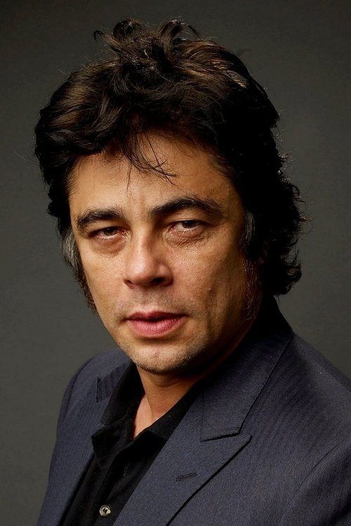
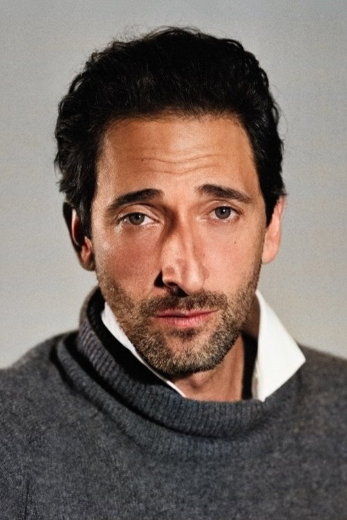



<nav class="films">
  

    <a href="../sweetheart-2021"><i class="fa-solid fa-chevron-left fa-xs"></i> Previous</a>
  

  

    <a class="simple" href="../">84 / 100</a>
  

  

    <a href="../the-power-of-the-dog-2021">Next <i class="fa-solid fa-chevron-right fa-xs"></i></a>
  

  

    
      Previous film:
      Sweetheart
    
    
      Next film:
      The Power of the Dog
    
  

</nav>

<article class="film slug-the-french-dispatch-2021">
  

    
    
  

  <h1>{{ film.title }} ({{ film | filmYear }})</h1>

  

    Language: {{ film.language }}.
    
  

  

    Directed by <strong>{{ film | directors }}</strong>
  

  
    <blockquote>
      {{ films.reviews[slug] | safe }} <em>—&nbsp;<a href="/bill">Bill</a></em>
    </blockquote>
  

  <section class="cast-grid">
  

    

  
  

    Benicio del Toro
    Moses Rosenthaler
  

    

  
  

    Adrien Brody
    Julian Cadazio
  

    

  
  

    Tilda Swinton
    J.K.L. Berensen
  

    

  
  

    Léa Seydoux
    Simone
  

    

  
  

    Frances McDormand
    Lucinda Krementz
  

    

  
  

    Timothée Chalamet
    Zeffirelli
  

    

  
  

    Lyna Khoudri
    Juliette
  

    

  
  

    Jeffrey Wright
    Roebuck Wright
  

    

  
  

    Mathieu Amalric
    The Commissaire
  

    

  
  

    Steve Park
    Nescaffier
  

    

  
  

    Bill Murray
    Arthur Howitzer, Jr.
  

    

  
  

    Owen Wilson
    Herbsaint Sazerac
  

  

</section>

  <section class="film-detail">
    

      

        

          <i class="fa-solid fa-masks-theater"></i>
          Cast
        

        <ul>
          
            <li>
              {{ cast.name }} as <em>{{ cast.character }}</em>
            </li>
          
        </ul>
      

      

        

          <i class="fa-solid fa-clapperboard"></i>
          Crew
        

        <ul>
          
            <li>
              {{ crew.name }} &mdash; <em>{{ crew.job }}</em>
            </li>
          
        </ul>
      

    

  </section>

  <section class="related-films">
  <h2>Related films</h2>
  <ul>
    <li><a href="../fargo-1996">Fargo</a> because of Frances McDormand and Steve Park</li>
<li><a href="../nomadland-2021">Nomadland</a> and <a href="../the-tragedy-of-macbeth-2021">The Tragedy of Macbeth</a> because of Frances McDormand</li>
<li><a href="../asteroid-city-2023">Asteroid City</a> because of Steve Park, Edward Norton, Jason Schwartzman, Willem Dafoe, Wes Anderson, Jarvis Cocker, Adrien Brody, Tilda Swinton, Tony Revolori, Bob Balaban, Fisher Stevens, Jeffrey Wright, Mohamed Belhadjine, Nicolas Avinée, Rupert Friend, Tom Hudson, Stéphane Bak, Liev Schreiber, Damien Bonnard, Rodolphe Pauly and Eliel Ford</li>
<li><a href="../fight-club-1999">Fight Club</a> because of Edward Norton</li>
<li><a href="../the-grand-budapest-hotel-2014">The Grand Budapest Hotel</a> because of Edward Norton, Jason Schwartzman, Wallace Wolodarsky, Willem Dafoe, Bill Murray, Wes Anderson, Owen Wilson, Adrien Brody, Mathieu Amalric, Saoirse Ronan, Léa Seydoux, Tilda Swinton, Tony Revolori, Larry Pine, Bob Balaban and Fisher Stevens</li>
<li><a href="../fantastic-mr-fox-2009">Fantastic Mr. Fox</a> because of Jason Schwartzman, Wallace Wolodarsky, Willem Dafoe, Bill Murray, Wes Anderson, Jarvis Cocker, Owen Wilson and Adrien Brody</li>
<li><a href="../the-lighthouse-2019">The Lighthouse</a> because of Willem Dafoe</li>
<li><a href="../dallas-buyers-club-2013">Dallas Buyers Club</a> because of Griffin Dunne</li>
<li><a href="../sink-or-swim-2018">Sink or Swim</a> because of Mathieu Amalric and Félix Moati</li>
<li><a href="../lady-bird-2017">Lady Bird</a> because of Saoirse Ronan, Timothée Chalamet and Lois Smith</li>
<li><a href="../little-women-2019">Little Women</a> because of Saoirse Ronan and Timothée Chalamet</li>
<li><a href="../one-fine-morning-2022">One Fine Morning</a> because of Léa Seydoux and Sharif Andoura</li>
<li><a href="../uncut-gems-2019">Uncut Gems</a> because of Tilda Swinton</li>
<li><a href="../cest-la-vie-2017">C'est la vie!</a> because of Benjamin Lavernhe</li>
<li><a href="../dune-2021">Dune</a> because of Timothée Chalamet</li>
  </ul>
</section>

</article>
