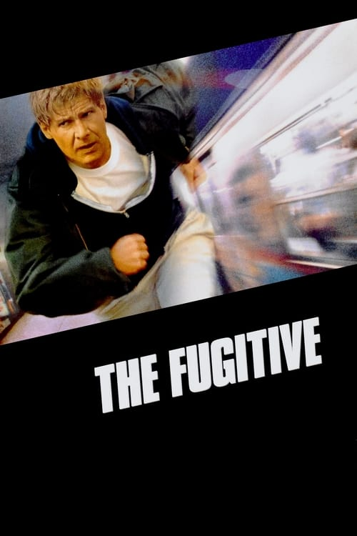
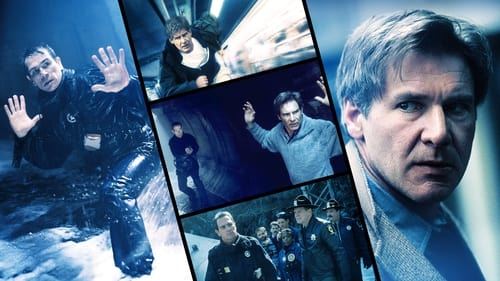

<nav class="films">
  <a class="prev" href="../night-on-earth">Previous</a>
  <a href="../">Film list</a>
  <a class="next" href="../whats-eating-gilbert-grape">Next</a>
</nav>

32 / 100

<article class="film">
  
  

  <h1>The Fugitive (1993)</h1>

  

    Directed by <strong>Andrew Davis</strong>
  

  <h2>
    Cast
  </h2>
  <ul>
    <li><strong>Harrison Ford</strong> as <em>Richard Kimble</em></li>
<li><strong>Tommy Lee Jones</strong> as <em>Samuel Gerard</em></li>
<li><strong>Joe Pantoliano</strong> as <em>Cosmo Renfro</em></li>
<li><strong>Jeroen Krabbé</strong> as <em>Charles Nichols</em></li>
<li><strong>Daniel Roebuck</strong> as <em>Biggs</em></li>
<li><strong>L. Scott Caldwell</strong> as <em>Poole</em></li>
<li><strong>Tom Wood</strong> as <em>Newman</em></li>
<li><strong>Ron Dean</strong> as <em>Detective Kelly</em></li>
<li><strong>Joseph F. Kosala</strong> as <em>Detective Rosetti</em></li>
<li><strong>Andreas Katsulas</strong> as <em>Frederick Sykes</em></li>
<li><strong>Sela Ward</strong> as <em>Helen Kimble</em></li>
<li><strong>Julianne Moore</strong> as <em>Anne Eastman</em></li>
<li><strong>Miguel Nino</strong> as <em>Chicago Cop #1</em></li>
<li><strong>John Drummond</strong> as <em>Newscaster</em></li>
<li><strong>Tony Fosco</strong> as <em>Chicago Cop #2</em></li>
<li><strong>Joseph F. Fisher</strong> as <em>Otto Sloan</em></li>
<li><strong>James Liautaud</strong> as <em>Paul</em></li>
<li><strong>David Darlow</strong> as <em>Dr. Lentz</em></li>
<li><strong>Tom Galouzis</strong> as <em>Surgeon</em></li>
<li><strong>James F. McKinsey</strong> as <em>Surgeon</em></li>
<li><strong>Mark D. Espinoza</strong> as <em>Resident</em></li>
<li><strong>John E. Ellis</strong> as <em>Anesthesiologist</em></li>
<li><strong>Gene Barge</strong> as <em>11th District Cop</em></li>
<li><strong>Thomas Charles Simmons</strong> as <em>11th District Cop</em></li>
<li><strong>Joe Guzaldo</strong> as <em>Prosecutor</em></li>
<li><strong>Dick Cusack</strong> as <em>Walter Gutherie</em></li>
<li><strong>Nicholas Kusenko</strong> as <em>Assistant Defense Attorney</em></li>
<li><strong>Joan Kohn</strong> as <em>Assistant Prosecuting Attorney</em></li>
<li><strong>Joe Guastaferro</strong> as <em>Coroner</em></li>
<li><strong>Andy Romano</strong> as <em>Judge Bennett</em></li>
<li><strong>Richard Riehle</strong> as <em>Old Guard</em></li>
<li><strong>Thom Vernon</strong> as <em>Carlson</em></li>
<li><strong>Ken Moreno</strong> as <em>Partida</em></li>
<li><strong>Eddie Bo Smith Jr.</strong> as <em>Copeland</em></li>
<li><strong>Frank Ray Perilli</strong> as <em>Jail Officer</em></li>
<li><strong>Otis Wilson</strong> as <em>Jail Officer</em></li>
<li><strong>Pancho Demmings</strong> as <em>Young Guard</em></li>
<li><strong>Jim Wilkey</strong> as <em>Bus Driver</em></li>
<li><strong>Danny Goldring</strong> as <em>Head Illinois State Trooper</em></li>
<li><strong>Nick Searcy</strong> as <em>Sheriff Rawlins</em></li>
<li><strong>Kevin Crowley</strong> as <em>State Trooper</em></li>
<li><strong>Michael James</strong> as <em>Head Welder</em></li>
<li><strong>Michael Skewes</strong> as <em>Highway Patrolman</em></li>
<li><strong>Ila Cathleen Stallings</strong> as <em>Duty Nurse</em></li>
<li><strong>Linda Casaletto</strong> as <em>Rural Hospital Nurse</em></li>
<li><strong>Cody Glenn</strong> as <em>Paramedic</em></li>
<li><strong>Cynthia Baker</strong> as <em>Woman in Car</em></li>
<li><strong>Johnny Lee Davenport</strong> as <em>Marshal Henry</em></li>
<li><strong>Mike Bacarella</strong> as <em>Marshal Stevens</em></li>
<li><strong>Bill Cusack</strong> as <em>Tracing Technician</em></li>
<li><strong>David U. Hodges</strong> as <em>Marshal David</em></li>
<li><strong>Lillie Richardson</strong> as <em>Copeland's Girlfriend</em></li>
<li><strong>Peter J. Caria IV</strong> as <em>Billy</em></li>
<li><strong>Tighe Barry</strong> as <em>Windshield Washer</em></li>
<li><strong>Monika Chabrowski</strong> as <em>Polish Landlady</em></li>
<li><strong>Lonnie Sima</strong> as <em>Landlady's Son</em></li>
<li><strong>Oksana Fedunyszyn</strong> as <em>Myoelectric Receptionist</em></li>
<li><strong>Orlando García</strong> as <em>Desmondo</em></li>
<li><strong>Afram Bill Williams</strong> as <em>Salesman</em></li>
<li><strong>Bruce L. Gewertz</strong> as <em>Dr. Bruce</em></li>
<li><strong>Jane Lynch</strong> as <em>Kathy Wahlund</em></li>
<li><strong>Joseph Rotkvich</strong> as <em>Officer Joseph</em></li>
<li><strong>Steven Lilovich</strong> as <em>Officer Steve</em></li>
<li><strong>Noelle Bou-Sliman</strong> as <em>Myoelectric Technician</em></li>
<li><strong>Roxanne Roberts</strong> as <em>Trauma Doctor</em></li>
<li><strong>Alex P. Hernandez</strong> as <em>Trauma Doctor</em></li>
<li><strong>Theron Touché Lykes</strong> as <em>Orderly</em></li>
<li><strong>Joel Robinson</strong> as <em>Boy Patient</em></li>
<li><strong>Greg Hollimon</strong> as <em>Skating Orderly</em></li>
<li><strong>Cheryl Lynn Bruce</strong> as <em>O.R. Doctor</em></li>
<li><strong>Marie Ware</strong> as <em>Nurse Gladys</em></li>
<li><strong>Bernard McGee</strong> as <em>Man</em></li>
<li><strong>Ann Whitney</strong> as <em>Myoelectric Director</em></li>
<li><strong>Lily Monkus</strong> as <em>Desk Clerk</em></li>
<li><strong>Willie Lucas</strong> as <em>Desk Clerk</em></li>
<li><strong>Turk Muller</strong> as <em>Clearing Officer</em></li>
<li><strong>Ana María Alvarez</strong> as <em>La Cubana</em></li>
<li><strong>Eugene F. Crededio</strong> as <em>Visitation Guard</em></li>
<li><strong>Maurice Person</strong> as <em>Clive Driscoll</em></li>
<li><strong>Terry Hard</strong> as <em>Officer Hormel</em></li>
<li><strong>Pam Zekman</strong> as <em>Newscaster</em></li>
<li><strong>David Pasquesi</strong> as <em>Newscaster</em></li>
<li><strong>Brent Shaphren</strong> as <em>Doctor at Bar</em></li>
<li><strong>Stephen A. Landsman</strong> as <em>Doctor at Bar</em></li>
<li><strong>B.J. Jones</strong> as <em>Doctor at Bar</em></li>
<li><strong>Dru Anne Carlson</strong> as <em>Gerard's Secretary</em></li>
<li><strong>Margaret Moore</strong> as <em>Nichols' Assistant</em></li>
<li><strong>Manny Lopez</strong> as <em>Seminar Doctor</em></li>
<li><strong>John M. Watson Sr.</strong> as <em>Bones Roosevelt</em></li>
<li><strong>Kirsten Nelson</strong> as <em>Betty</em></li>
<li><strong>Juan Ramírez</strong> as <em>Man on 'El'</em></li>
<li><strong>Neil Flynn</strong> as <em>Transit Cop</em></li>
<li><strong>Allen Hamilton</strong> as <em>Host</em></li>
<li><strong>Eric Fudala</strong> as <em>Hotel Security Guard</em></li>
<li><strong>Lester Holt</strong> as <em>Newscaster</em></li>
<li><strong>Jay Levine</strong> as <em>Newscaster</em></li>
<li><strong>Sal Richards</strong> as <em>Warrant Captain (uncredited)</em></li>
<li><strong>Darren W. Conrad</strong> as <em>Deputy at Train Wreck (uncredited)</em></li>
<li><strong>Kevin Mukherji</strong> as <em>Doctor (uncredited)</em></li>
<li><strong>John-Clay Scott</strong> as <em>Mad Motorist at Tunnel (uncredited)</em></li>
<li><strong>Suzy Brack</strong> as <em>City Hall Employee (uncredited)</em></li>
<li><strong>Gene Kelly</strong> as <em>US Marshall (uncredited)</em></li>
  </ul>
</article>
<footer>
  <a href="../about">About this list</a>
</footer>
