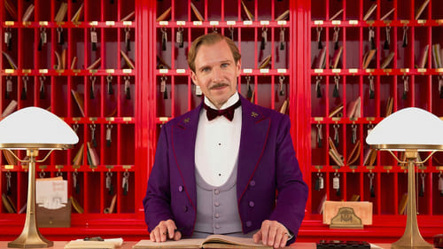



<nav class="films">
  <a class="prev" href="../dallas-buyers-club-2013">Previous</a>
  <a href="../">Film list</a>
  <a class="next" href="../mr-turner-2014">Next</a>
</nav>

63 / 100

<article class="film">
  

    
    
  

  <h1>The Grand Budapest Hotel ({{ film | filmYear }})</h1>

  

  

    Directed by <strong>{{ film | directors }}</strong>
  

  <h2>
    Cast
  </h2>
  <ul>
            <li><strong>Ralph Fiennes</strong> as <em>M. Gustave</em></li>
        <li><strong>F. Murray Abraham</strong> as <em>Mr. Moustafa</em></li>
        <li><strong>Mathieu Amalric</strong> as <em>Serge X.</em></li>
        <li><strong>Adrien Brody</strong> as <em>Dmitri</em></li>
        <li><strong>Willem Dafoe</strong> as <em>Jopling</em></li>
        <li><strong>Jeff Goldblum</strong> as <em>Deputy Kovacs</em></li>
        <li><strong>Harvey Keitel</strong> as <em>Ludwig</em></li>
        <li><strong>Jude Law</strong> as <em>Young Author</em></li>
        <li><strong>Bill Murray</strong> as <em>M. Ivan</em></li>
        <li><strong>Edward Norton</strong> as <em>Henckels</em></li>
        <li><strong>Saoirse Ronan</strong> as <em>Agatha</em></li>
        <li><strong>Jason Schwartzman</strong> as <em>M. Jean</em></li>
        <li><strong>Léa Seydoux</strong> as <em>Clotilde</em></li>
        <li><strong>Tilda Swinton</strong> as <em>Madame D.</em></li>
        <li><strong>Tom Wilkinson</strong> as <em>Author</em></li>
        <li><strong>Owen Wilson</strong> as <em>M. Chuck</em></li>
        <li><strong>Tony Revolori</strong> as <em>Zero</em></li>
        <li><strong>Larry Pine</strong> as <em>Mr. Mosher</em></li>
        <li><strong>Giselda Volodi</strong> as <em>Serge's Sister</em></li>
        <li><strong>Florian Lukas</strong> as <em>Pinky</em></li>
        <li><strong>Karl Markovics</strong> as <em>Wolf</em></li>
        <li><strong>Volker Michalowski</strong> as <em>Günther</em></li>
        <li><strong>Neal Huff</strong> as <em>Lieutenant</em></li>
        <li><strong>Bob Balaban</strong> as <em>M. Martin</em></li>
        <li><strong>Fisher Stevens</strong> as <em>M. Robin</em></li>
        <li><strong>Wallace Wolodarsky</strong> as <em>M. Georges</em></li>
        <li><strong>Waris Ahluwalia</strong> as <em>M. Dino</em></li>
        <li><strong>Jella Niemann</strong> as <em>Student</em></li>
        <li><strong>Marcel Mazur</strong> as <em>Author's Grandson</em></li>
        <li><strong>Robert Bienas</strong> as <em>Alpine Hiker</em></li>
        <li><strong>Manfred Lindner</strong> as <em>Front Desk (1968)</em></li>
        <li><strong>Oliver Claridge</strong> as <em>Composer</em></li>
        <li><strong>Bernhard Kremser</strong> as <em>Businessman</em></li>
        <li><strong>Kunichi Nomura</strong> as <em>Actor</em></li>
        <li><strong>Sister Anna Rademacher</strong> as <em>Nun</em></li>
        <li><strong>Heinz-Werner Jeschkowski</strong> as <em>Bather</em></li>
        <li><strong>Steffen Scheumann</strong> as <em>Head Waiter (1968)</em></li>
        <li><strong>Sabine Euler</strong> as <em>Schoolteacher</em></li>
        <li><strong>Renate Klein</strong> as <em>Widow</em></li>
        <li><strong>Uwe Holoubek</strong> as <em>Second Waiter (1968)</em></li>
        <li><strong>Francesco Zippel</strong> as <em>Footman (1932)</em></li>
        <li><strong>Enrico Hoffmann</strong> as <em>Footman (1932)</em></li>
        <li><strong>Daniel Steiner</strong> as <em>Anatole</em></li>
        <li><strong>Marie Goyette</strong> as <em>Housekeeper (1932)</em></li>
        <li><strong>Hendrik von Bültzingslöwen</strong> as <em>Ernst</em></li>
        <li><strong>Paul Schlase</strong> as <em>Igor</em></li>
        <li><strong>Jenő Orosz</strong> as <em>Doorman (1932)</em></li>
        <li><strong>Gyula Lukács</strong> as <em>Doorman (1932)</em></li>
        <li><strong>Darin Damjanow</strong> as <em>Chauffeur</em></li>
        <li><strong>Dar Ronge</strong> as <em>Crippled Shoeshine Boy</em></li>
        <li><strong>Georg Rittmannsperger</strong> as <em>Front Desk (1932)</em></li>
        <li><strong>Dirk Bossmann</strong> as <em>Front Desk (1932)</em></li>
        <li><strong>Arwin Lobedann</strong> as <em>Front Desk (1932)</em></li>
        <li><strong>Robin Hurlstone</strong> as <em>Herr Schneider</em></li>
        <li><strong>Jutta Westphal</strong> as <em>Frau Liebling</em></li>
        <li><strong>Matthias Holfert</strong> as <em>Chef (1932)</em></li>
        <li><strong>Lisa Kreuzer</strong> as <em>Grande Dame</em></li>
        <li><strong>Gisela Bech</strong> as <em>Grande Dame</em></li>
        <li><strong>Birgit Müller</strong> as <em>Grande Dame</em></li>
        <li><strong>Ursula Kuhnt</strong> as <em>Grande Dame</em></li>
        <li><strong>Monika Krüger</strong> as <em>Grande Dame</em></li>
        <li><strong>Wolfram Nielacny</strong> as <em>Herr Becker</em></li>
        <li><strong>Reinhold Hegelow</strong> as <em>Head Waiter (1932)</em></li>
        <li><strong>Steffen Nixdorf</strong> as <em>Second Waiter (1932)</em></li>
        <li><strong>Rainer Reiners</strong> as <em>Herr Mendl</em></li>
        <li><strong>Milton Welsh</strong> as <em>Franz</em></li>
        <li><strong>Piet Paes</strong> as <em>Taxi Driver</em></li>
        <li><strong>Michaela Caspar</strong> as <em>Marguerite</em></li>
        <li><strong>Sabine Urig</strong> as <em>Laetizia</em></li>
        <li><strong>Heike Hanold-Lynch</strong> as <em>Carolina</em></li>
        <li><strong>Roy Macready</strong> as <em>Old Man</em></li>
        <li><strong>John Peet</strong> as <em>Young Man</em></li>
        <li><strong>Carl Sprague</strong> as <em>Distant Relation</em></li>
        <li><strong>Golo Euler</strong> as <em>Lutz Police Militia</em></li>
        <li><strong>Jürgen Schwämmle</strong> as <em>Lutz Police Militia</em></li>
        <li><strong>Frank Jacob</strong> as <em>Giant Convict</em></li>
        <li><strong>Roman Berger</strong> as <em>Parcel Inspector</em></li>
        <li><strong>Michael Benthin</strong> as <em>Snitch</em></li>
        <li><strong>Matthias Matschke</strong> as <em>Prison Guard</em></li>
        <li><strong>Lennart Meyer</strong> as <em>Lobby Boy</em></li>
        <li><strong>Alfred Hänel</strong> as <em>Lobby Boy</em></li>
        <li><strong>Manpreet Gerlach</strong> as <em>Lobby Boy</em></li>
        <li><strong>David Adamik</strong> as <em>Lobby Boy</em></li>
        <li><strong>Moritz Hepper</strong> as <em>Lobby Boy</em></li>
        <li><strong>David Cioffi</strong> as <em>Cook</em></li>
        <li><strong>Lucas Hedges</strong> as <em>Pump Attendant</em></li>
        <li><strong>Wolfgang Czeczor</strong> as <em>Monk</em></li>
        <li><strong>Philipp Sonntag</strong> as <em>Monk</em></li>
        <li><strong>Hans Martin Stier</strong> as <em>Monk</em></li>
        <li><strong>Georg Tryphon</strong> as <em>Monk</em></li>
        <li><strong>Gabriel Rush</strong> as <em>Otto</em></li>
        <li><strong>Hannes Wegener</strong> as <em>Soldier</em></li>
        <li><strong>Gerald Sullivan</strong> as <em>Soldier</em></li>
        <li><strong>Oliver Hazell</strong> as <em>Soldier</em></li>
        <li><strong>Ben Howard</strong> as <em>Soldier</em></li>
        <li><strong>Bohumil Váchal</strong> as <em>Judge</em></li>
        <li><strong>Marko Dyrlich</strong> as <em>Zig-Zag</em></li>
        <li><strong>Ed Munro</strong> as <em>'Boy with Apple' (model)</em></li>
  </ul>
</article>
<footer>
  <a href="../about">About this list</a>
</footer>
