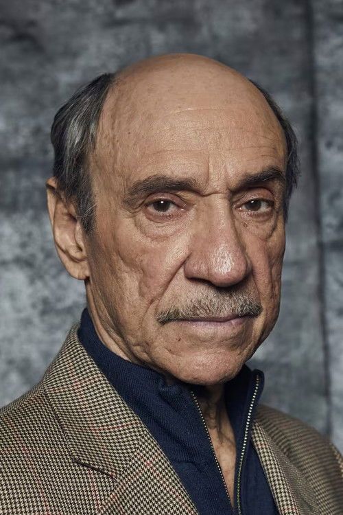
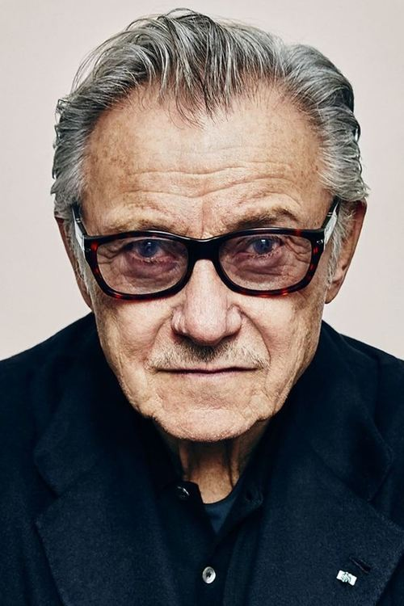



<nav class="films">
  

    <a href="../mr-turner-2014"><i class="fa-solid fa-chevron-left fa-xs"></i> Previous</a>
  

  

    <a class="simple" href="../">56 / 100</a>
  

  

    <a href="../taxi-2015">Next <i class="fa-solid fa-chevron-right fa-xs"></i></a>
  

  

    
      Previous film:
      Mr. Turner
    
    
      Next film:
      Taxi
    
  

</nav>

<article class="film slug-the-grand-budapest-hotel-2014">
  

    
    
  

  <h1>{{ film.title }} ({{ film | filmYear }})</h1>

  

    Language: {{ film.language }}.
    
  

  

    Directed by <strong>{{ film | directors }}</strong>
  

  
    <blockquote>
      {{ films.reviews[slug] | safe }} <em>—&nbsp;<a href="/bill">Bill</a></em>
    </blockquote>
  

  <section class="cast-grid">
  

    

  
  

    Ralph Fiennes
    M. Gustave
  

    

  
  

    F. Murray Abraham
    Mr. Moustafa
  

    

  
  

    Mathieu Amalric
    Serge X.
  

    

  
  

    Adrien Brody
    Dmitri
  

    

  
  

    Willem Dafoe
    Jopling
  

    

  
  

    Jeff Goldblum
    Deputy Kovacs
  

    

  
  

    Harvey Keitel
    Ludwig
  

    

  
  

    Jude Law
    Young Author
  

    

  
  

    Bill Murray
    M. Ivan
  

    

  
  

    Edward Norton
    Henckels
  

    

  
  

    Saoirse Ronan
    Agatha
  

    

  
  

    Jason Schwartzman
    M. Jean
  

  

</section>

  <section class="film-detail">
    

      

        

          <i class="fa-solid fa-masks-theater"></i>
          Cast
        

        <ul>
          
            <li>
              {{ cast.name }} as <em>{{ cast.character }}</em>
            </li>
          
        </ul>
      

      

        

          <i class="fa-solid fa-clapperboard"></i>
          Crew
        

        <ul>
          
            <li>
              {{ crew.name }} &mdash; <em>{{ crew.job }}</em>
            </li>
          
        </ul>
      

    

  </section>

  <section class="related-films">
  <h2>Related films</h2>
  <ul>
    <li><a href="../fight-club-1999">Fight Club</a> because of Edward Norton</li>
<li><a href="../the-french-dispatch-2021">The French Dispatch</a> because of Edward Norton, Jason Schwartzman, Wallace Wolodarsky, Willem Dafoe, Bill Murray, Wes Anderson, Owen Wilson, Adrien Brody, Mathieu Amalric, Saoirse Ronan, Léa Seydoux, Tilda Swinton, Tony Revolori, Larry Pine, Bob Balaban and Fisher Stevens</li>
<li><a href="../asteroid-city-2023">Asteroid City</a> because of Edward Norton, Jason Schwartzman, Willem Dafoe, Wes Anderson, Adrien Brody, Jeff Goldblum, Tilda Swinton, Tony Revolori, Bob Balaban and Fisher Stevens</li>
<li><a href="../the-talented-mr-ripley-1999">The Talented Mr. Ripley</a> because of Jude Law</li>
<li><a href="../in-bruges-2008">In Bruges</a> because of Ralph Fiennes</li>
<li><a href="../fantastic-mr-fox-2009">Fantastic Mr. Fox</a> because of Jason Schwartzman, Wallace Wolodarsky, Willem Dafoe, Bill Murray, Robin Hurlstone, Wes Anderson, Owen Wilson and Adrien Brody</li>
<li><a href="../the-lighthouse-2019">The Lighthouse</a> because of Willem Dafoe</li>
<li><a href="../sink-or-swim-2018">Sink or Swim</a> because of Mathieu Amalric</li>
<li><a href="../lady-bird-2017">Lady Bird</a> because of Saoirse Ronan and Lucas Hedges</li>
<li><a href="../little-women-2019">Little Women</a> because of Saoirse Ronan</li>
<li><a href="../one-fine-morning-2022">One Fine Morning</a> because of Léa Seydoux</li>
<li><a href="../uncut-gems-2019">Uncut Gems</a> because of Tilda Swinton</li>
  </ul>
</section>

</article>
