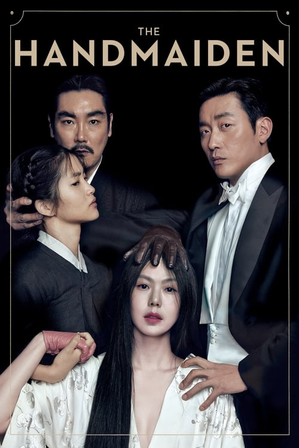

<nav class="films">
  <a class="prev" href="../interstellar">Previous</a>
  <a href="../">Film list</a>
  <a class="next" href="../maudie">Next</a>
</nav>

65 / 100

<article class="film">
  <h1>The Handmaiden (2016)</h1>

  

    Directed by <strong>Park Chan-wook</strong>
  

  

  <h2>
    Cast
  </h2>
  <ul>
    <li><strong>Kim Min-hee</strong> as <em>Lady Hideko</em></li>
<li><strong>Kim Tae-ri</strong> as <em>Sook-hee</em></li>
<li><strong>Ha Jung-woo</strong> as <em>Count Fujiwara</em></li>
<li><strong>Cho Jin-woong</strong> as <em>Uncle Kouzuki</em></li>
<li><strong>Kim Hae-sook</strong> as <em>Ms. Sasaki</em></li>
<li><strong>Moon So-ri</strong> as <em>Hideko's Aunt</em></li>
<li><strong>Lee Yong-nyeo</strong> as <em>Bok-soon</em></li>
<li><strong>Kwak Eun-jin</strong> as <em>Kkeut-dan</em></li>
<li><strong>Lee Dong-hwi</strong> as <em>Goo-gai</em></li>
<li><strong>Jo Eun-hyung</strong> as <em>Young Hideko</em></li>
<li><strong>Rina Takagi</strong> as <em>Hideko's Mother</em></li>
<li><strong>Han Ha-na</strong> as <em>Junko</em></li>
<li><strong>Lee Kyu-jung</strong> as <em>Maid 1</em></li>
<li><strong>Kim See-eun</strong> as <em>Maid 2</em></li>
<li><strong>Ha Si-yeon</strong> as <em>Maid 3</em></li>
<li><strong>Eun-yeong Kim</strong> as <em>Maid 4</em></li>
<li><strong>Jeong Ha-dam</strong> as <em>Maid 5</em></li>
<li><strong>Yoo Min-chae</strong> as <em>Ggeut-dan</em></li>
<li><strong>Won Geun-hee</strong> as <em>Butler</em></li>
<li><strong>Kim Jong-dae</strong> as <em>Mansion Driver</em></li>
<li><strong>Jang Han-sun</strong> as <em>Kouzuki Porter</em></li>
<li><strong>Kim Lee-woo</strong> as <em>Japanese Officer 1</em></li>
<li><strong>Shinsuke Fujimoto</strong> as <em>Japanese Officer 2</em></li>
<li><strong>Katsuhiro Nagano</strong> as <em>Monk</em></li>
<li><strong>Lee Ji-ha</strong> as <em>Female Owner of Ryokan</em></li>
<li><strong>Tomomitsu Adachi</strong> as <em>Mental Hospital Doctor 1</em></li>
<li><strong>Takashi Kakizawa</strong> as <em>Mental Hospital Doctor 2</em></li>
<li><strong>Seo-Yoon Hwang</strong> as <em>Mental Hospital Nurse 1</em></li>
<li><strong>Shin-hye Park</strong> as <em>Mental Hospital Nurse 2</em></li>
<li><strong>Lee Ji-hye</strong> as <em>Young Hideko's Maid 1</em></li>
<li><strong>So-Yeon Heo</strong> as <em>Young Hideko's Maid 2</em></li>
<li><strong>Lee Yoon-jae</strong> as <em>'The Golden Lotus' Reading Guest 1</em></li>
<li><strong>Choi Jong-ryul</strong> as <em>'The Golden Lotus' Reading Guest 2</em></li>
<li><strong>Kim Joon-woo</strong> as <em>'The Golden Lotus' Reading Guest 3</em></li>
<li><strong>Bae Il-hyuck</strong> as <em>'The Golden Lotus' Reading Guest 4</em></li>
<li><strong>Kim Soo-woong</strong> as <em>'The Golden Lotus' Reading Guest 5</em></li>
<li><strong>Yong-Hyun Jo</strong> as <em>'The Golden Lotus' Reading Guest 6</em></li>
<li><strong>Park Ki-ryung</strong> as <em>'The Whip Speaks' Reading Guest 1</em></li>
<li><strong>Choi Byung-mo</strong> as <em>'The Whip Speaks' Reading Guest 2</em></li>
<li><strong>Han Chang-hyun</strong> as <em>'The Whip Speaks' Reading Guest 3</em></li>
<li><strong>Kim In-woo</strong> as <em>'The Whip Speaks' Reading Guest 4</em></li>
<li><strong>Kwon Hyuk</strong> as <em>'The Whip Speaks' Reading Guest 5</em></li>
<li><strong>Hyung-tae Im</strong> as <em>'The Whip Speaks' Reading Guest 6</em></li>
<li><strong>Oh Man-seok</strong> as <em>'Bells of Passion' Reading Guest 1</em></li>
<li><strong>Kim Byung Gi</strong> as <em>'Bells of Passion' Reading Guest 2</em></li>
<li><strong>In-su Kim</strong> as <em>'Bells of Passion' Reading Guest 3</em></li>
<li><strong>Alexander Scarborough</strong> as <em>Pyeonghwa Hotel Restaurant Manager</em></li>
<li><strong>Jin-Chul Kim</strong> as <em>Pyeonghwa Hotel Restaurant Guest 1</em></li>
<li><strong>Do-Hyung Kim</strong> as <em>Pyeonghwa Hotel Restaurant Guest 2</em></li>
<li><strong>Eun-ji Hong</strong> as <em>Pyeonghwa Hotel Restaurant Guest 3</em></li>
<li><strong>Song Da-eun</strong> as <em>Pyeonghwa Hotel Restaurant Guest 4</em></li>
<li><strong>Jeong In-kyeom</strong> as <em>Ronin 1</em></li>
<li><strong>Nam Gyeong-min</strong> as <em>Ronin 2</em></li>
<li><strong>Ahn Seong-bong</strong> as <em>Harbor Ticket Office Ronin</em></li>
<li><strong>Seon Uk-hyeon</strong> as <em>Harbor Ticket Office Staff</em></li>
<li><strong>Lee In-chul</strong> as <em>Photo Studio Owner</em></li>
  </ul>
</article>
<footer>
  <a href="../about">About this list</a>
</footer>
