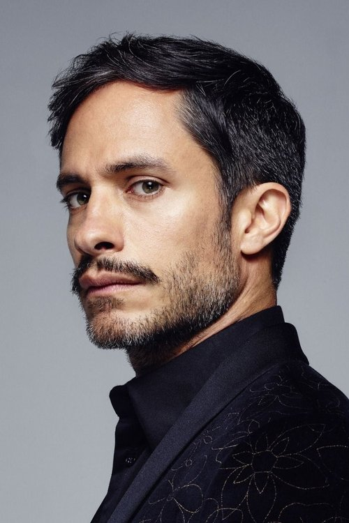
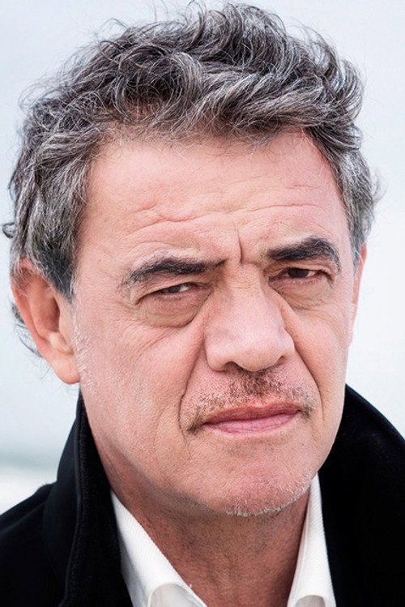
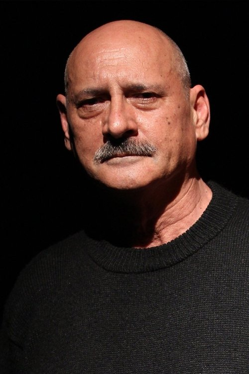



<nav class="films">
  

    <a href="../phone-booth-2003"><i class="fa-solid fa-chevron-left fa-xs"></i> Previous</a>
  

  

    <a class="simple" href="../">44 / 100</a>
  

  

    <a href="../hot-fuzz-2007">Next <i class="fa-solid fa-chevron-right fa-xs"></i></a>
  

  

    
      Previous film:
      Phone Booth
    
    
      Next film:
      Hot Fuzz
    
  

</nav>

<article class="film slug-the-motorcycle-diaries-2004">
  

    
    
  

  <h1>{{ film.title }} ({{ film | filmYear }})</h1>

  

    Language: {{ film.language }}.
    Also known as Diarios de motocicleta.
  

  

    Directed by <strong>{{ film | directors }}</strong>
  

  
    <blockquote>
      {{ films.reviews[slug] | safe }} <em>—&nbsp;<a href="/bill">Bill</a></em>
    </blockquote>
  

  <section class="cast-grid">
  

    

  
  

    Gael García Bernal
    Ernesto "Che" Guevara de la Serna
  

    

  
  

    Rodrigo de la Serna
    Alberto Granado
  

    

  
  

    Mercedes Morán
    Celia de la Serna
  

    

  
  

    Mía Maestro
    Chichina Ferreyra
  

    

  
  

    Jean Pierre Noher
    Ernesto Guevara Lynch
  

    

  
<i class="fa-solid fa-user"></i>

  

    Lucas Oro
    Roberto Guevara
  

    

  
  

    Marina Glezer
    Celita Guevara
  

    

  
  

    Sofia Bertolotto
    Ana María Guevara
  

    

  
<i class="fa-solid fa-user"></i>

  

    Franco Solazzi
    Juan Martín Guevara
  

    

  
  

    Ricardo Díaz Mourelle
    Uncle Jorge
  

    

  
  

    Gustavo Bueno
    Dr. Hugo Pesce
  

    

  
  

    Antonella Costa
    Silvia
  

  

</section>

  <section class="film-detail">
    

      

        

          <i class="fa-solid fa-masks-theater"></i>
          Cast
        

        <ul>
          
            <li>
              {{ cast.name }} as <em>{{ cast.character }}</em>
            </li>
          
        </ul>
      

      

        

          <i class="fa-solid fa-clapperboard"></i>
          Crew
        

        <ul>
          
            <li>
              {{ crew.name }} &mdash; <em>{{ crew.job }}</em>
            </li>
          
        </ul>
      

    

  </section>

  
</article>
