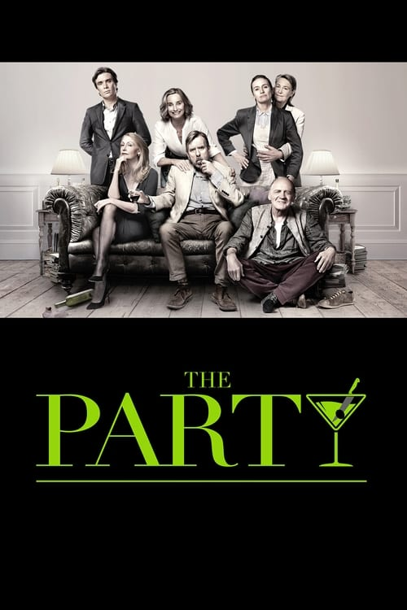
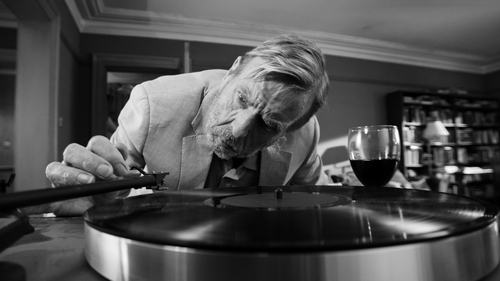



<nav class="films">
  <a class="prev" href="../maudie-2016">Previous</a>
  <a href="../">Film list</a>
  <a class="next" href="../lucky-2017">Next</a>
</nav>

68 / 100

<article class="film">
  

    
    
  

  <h1>The Party ({{ film | filmYear }})</h1>

  

  

    Directed by <strong>{{ film | directors }}</strong>
  

  <h2>
    Cast
  </h2>
  <ul>
            <li><strong>Patricia Clarkson</strong> as <em>April</em></li>
        <li><strong>Cherry Jones</strong> as <em>Martha</em></li>
        <li><strong>Kristin Scott Thomas</strong> as <em>Janet</em></li>
        <li><strong>Bruno Ganz</strong> as <em>Godfried</em></li>
        <li><strong>Timothy Spall</strong> as <em>Bill</em></li>
        <li><strong>Emily Mortimer</strong> as <em>Jinny</em></li>
        <li><strong>Cillian Murphy</strong> as <em>Tom</em></li>
  </ul>
</article>
<footer>
  <a href="../about">About this list</a>
</footer>
