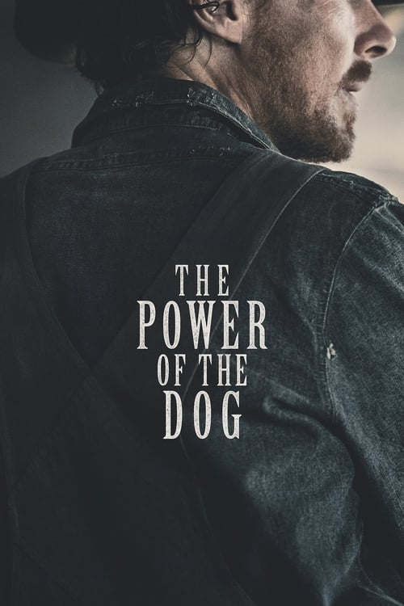



<nav class="films">
  <a class="prev" href="../the-french-dispatch-2021">Previous</a>
  <a href="../">Film list</a>
  <a class="next" href="../belfast-2021">Next</a>
</nav>

86 / 100

<article class="film">
  

    
    
  

  <h1>The Power of the Dog ({{ film | filmYear }})</h1>

  

  

    Directed by <strong>{{ film | directors }}</strong>
  

  <h2>
    Cast
  </h2>
  <ul>
            <li><strong>Benedict Cumberbatch</strong> as <em>Phil Burbank</em></li>
        <li><strong>Kodi Smit-McPhee</strong> as <em>Peter Gordon</em></li>
        <li><strong>Kirsten Dunst</strong> as <em>Rose Gordon</em></li>
        <li><strong>Jesse Plemons</strong> as <em>George Burbank</em></li>
        <li><strong>Thomasin McKenzie</strong> as <em>Lola</em></li>
        <li><strong>Geneviève Lemon</strong> as <em>Mrs. Lewis</em></li>
        <li><strong>Keith Carradine</strong> as <em>The Governor</em></li>
        <li><strong>Frances Conroy</strong> as <em>Old Lady</em></li>
        <li><strong>Kenneth Radley</strong> as <em>Barkeep</em></li>
        <li><strong>Sean Keenan</strong> as <em>Sven</em></li>
        <li><strong>George Mason</strong> as <em>Cricket</em></li>
        <li><strong>Ramontay McConnell</strong> as <em>Theo</em></li>
        <li><strong>David Denis</strong> as <em>Angelo</em></li>
        <li><strong>Cohen Holloway</strong> as <em>Bobby</em></li>
        <li><strong>Max Mata</strong> as <em>Juan</em></li>
        <li><strong>Josh Owen</strong> as <em>Lee</em></li>
        <li><strong>Alistair Sewell</strong> as <em>Jock</em></li>
        <li><strong>Eddie Campbell</strong> as <em>Stan</em></li>
        <li><strong>Alice Englert</strong> as <em>Buster</em></li>
        <li><strong>Bryony Skillington</strong> as <em>Queenie</em></li>
        <li><strong>Jacque Drew</strong> as <em>Jeanie</em></li>
        <li><strong>Yvette Parsons</strong> as <em>Hettie</em></li>
        <li><strong>Aislinn Furlong</strong> as <em>Evie</em></li>
        <li><strong>Daniel Cleary</strong> as <em>Jeanie's Friend</em></li>
        <li><strong>Richard Falkner</strong> as <em>Pianola Man</em></li>
        <li><strong>Tatum Warren-Ngata</strong> as <em>Libby</em></li>
        <li><strong>Yvette Reid</strong> as <em>Clementine</em></li>
        <li><strong>Alice May Connolly</strong> as <em>Pearl</em></li>
        <li><strong>Stephen Lovatt</strong> as <em>Doctor</em></li>
        <li><strong>Stephen Bain</strong> as <em>Mr Weltz the Undertaker</em></li>
        <li><strong>Ella Hope-Higginson</strong> as <em>Consuela</em></li>
        <li><strong>Piimio Mei</strong> as <em>Sue Ella</em></li>
        <li><strong>Edith Poor</strong> as <em>Tanya</em></li>
        <li><strong>Vadim Ledogorov</strong> as <em>Older Man</em></li>
        <li><strong>Julie Forsyth</strong> as <em>Mrs Mueller</em></li>
        <li><strong>Peter Carroll</strong> as <em>Old Gent</em></li>
        <li><strong>Alison Bruce</strong> as <em>The Governor's Wife</em></li>
        <li><strong>Karl Willetts</strong> as <em>Bill</em></li>
        <li><strong>David T. Lim</strong> as <em>Cook</em></li>
        <li><strong>Adam Beach</strong> as <em>Edward Nappo</em></li>
        <li><strong>Maeson Stone Skuggedal</strong> as <em>Edward Nappo's Son</em></li>
        <li><strong>Ian Harcourt</strong> as <em>Undertaker Assistant</em></li>
  </ul>
</article>
<footer>
  <a href="../about">About this list</a>
</footer>
