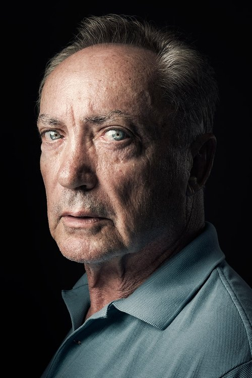



<nav class="films">
  

    <a href="../nouvelle-vague-2025"><i class="fa-solid fa-chevron-left fa-xs"></i> Previous</a>
  

  

    <a class="simple" href="../">100 / 100</a>
  

  

    Next <i class="fa-solid fa-chevron-right fa-xs"></i>
  

  

    
      Previous film:
      Nouvelle Vague
    
    
      Next film:
      End of list
    
  

</nav>

<article class="film slug-the-secret-agent-2025">
  

    
    
  

  <h1>{{ film.title }} ({{ film | filmYear }})</h1>

  

    Language: {{ film.language }}.
    Also known as O Agente Secreto.
  

  

    Directed by <strong>{{ film | directors }}</strong>
  

  
    <blockquote>
      {{ films.reviews[slug] | safe }} <em>—&nbsp;<a href="/bill">Bill</a></em>
    </blockquote>
  

  <section class="cast-grid">
  

    

  
  

    Wagner Moura
    Armando Solimões / Marcelo Alves / Adult Fernando Solimões
  

    

  
  

    Tânia Maria
    Dona Sebastiana
  

    

  
  

    Alice Carvalho
    Fátima
  

    

  
  

    Maria Fernanda Cândido
    Elza / Sara Guébert
  

    

  
  

    Gabriel Leone
    Bobbi Borba
  

    

  
  

    Udo Kier
    Hans
  

    

  
  

    Carlos Francisco
    Seu Alexandre
  

    

  
  

    Thomás Aquino
    Valdemar
  

    

  
  

    Hermila Guedes
    Claudia
  

    

  
  

    Robério Diógenes
    Euclides Cavalcante
  

    

  
  

    Roney Villela
    Augusto Borba
  

    

  
  

    Isabél Zuaa
    Thereza Vitória
  

  

</section>

  <section class="film-detail">
    

      

        

          <i class="fa-solid fa-masks-theater"></i>
          Cast
        

        <ul>
          
            <li>
              {{ cast.name }} as <em>{{ cast.character }}</em>
            </li>
          
        </ul>
      

      

        

          <i class="fa-solid fa-clapperboard"></i>
          Crew
        

        <ul>
          
            <li>
              {{ crew.name }} &mdash; <em>{{ crew.job }}</em>
            </li>
          
        </ul>
      

    

  </section>

  
</article>
