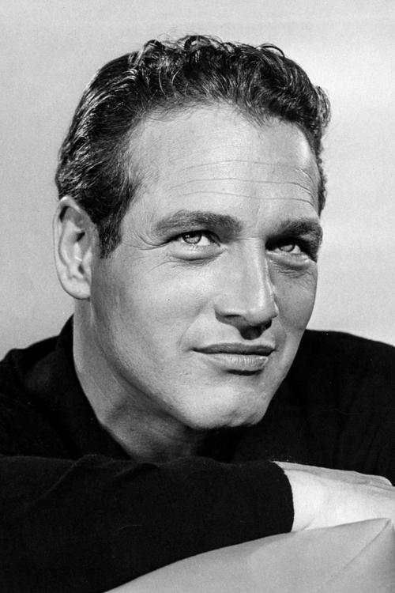
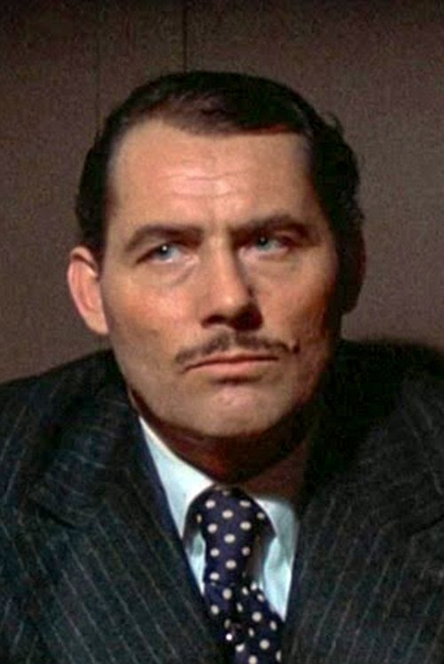
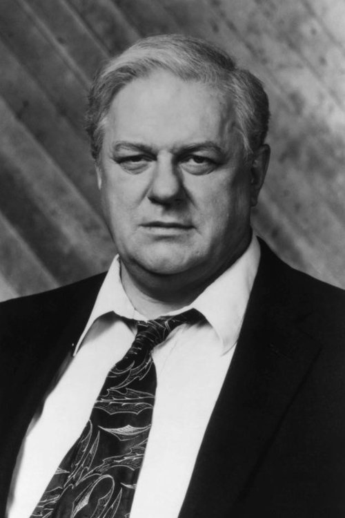
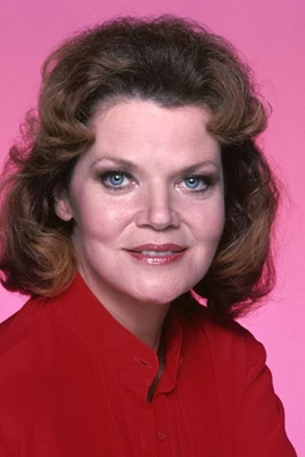
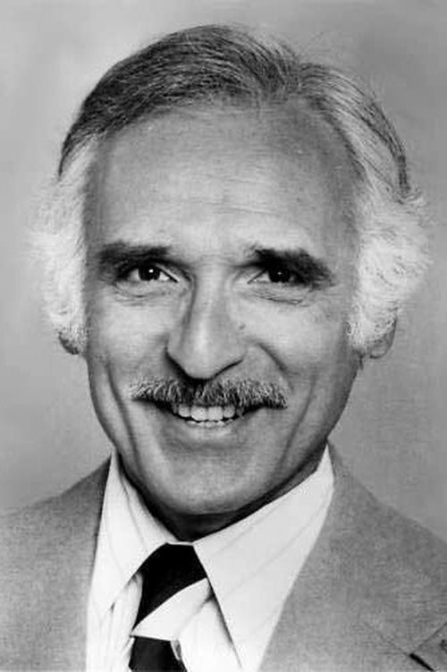
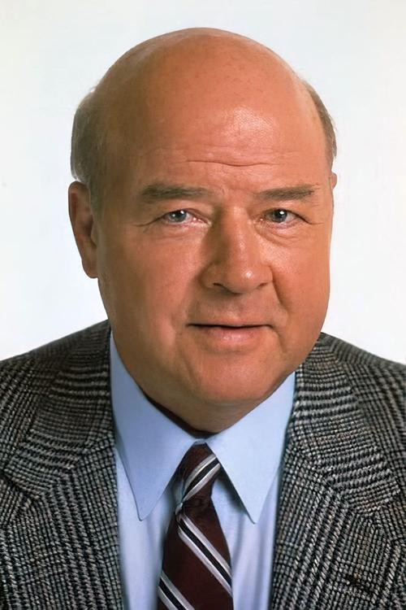
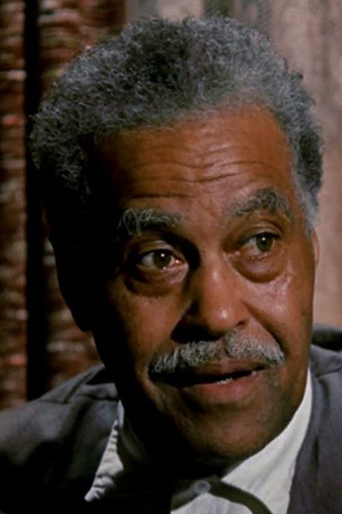



<nav class="films">
  

    <a href="../once-upon-a-time-in-the-west-1968"><i class="fa-solid fa-chevron-left fa-xs"></i> Previous</a>
  

  

    <a class="simple" href="../">11 / 100</a>
  

  

    <a href="../day-for-night-1973">Next <i class="fa-solid fa-chevron-right fa-xs"></i></a>
  

  

    
      Previous film:
      Once Upon a Time in the West
    
    
      Next film:
      Day for Night
    
  

</nav>

<article class="film slug-the-sting-1973">
  

    
    
  

  <h1>{{ film.title }} ({{ film | filmYear }})</h1>

  

    Language: {{ film.language }}.
    
  

  

    Directed by <strong>{{ film | directors }}</strong>
  

  
    <blockquote>
      {{ films.reviews[slug] | safe }} <em>—&nbsp;<a href="/bill">Bill</a></em>
    </blockquote>
  

  <section class="cast-grid">
  

    

  
  

    Paul Newman
    Henry Gondorff
  

    

  
  

    Robert Redford
    Johnny Hooker
  

    

  
  

    Robert Shaw
    Doyle Lonnegan
  

    

  
  

    Charles Durning
    Lt. Wm. Snyder
  

    

  
  

    Ray Walston
    J.J. Singleton
  

    

  
  

    Eileen Brennan
    Billie
  

    

  
  

    Harold Gould
    Kid Twist
  

    

  
  

    John Heffernan
    Eddie Niles
  

    

  
  

    Dana Elcar
    F.B.I. Agent Polk
  

    

  
  

    Jack Kehoe
    Erie Kid
  

    

  
  

    Dimitra Arliss
    Loretta
  

    

  
  

    Robert Earl Jones
    Luther Coleman
  

  

</section>

  <section class="film-detail">
    

      

        

          <i class="fa-solid fa-masks-theater"></i>
          Cast
        

        <ul>
          
            <li>
              {{ cast.name }} as <em>{{ cast.character }}</em>
            </li>
          
        </ul>
      

      

        

          <i class="fa-solid fa-clapperboard"></i>
          Crew
        

        <ul>
          
            <li>
              {{ crew.name }} &mdash; <em>{{ crew.job }}</em>
            </li>
          
        </ul>
      

    

  </section>

  <section class="related-films">
  <h2>Related films</h2>
  <ul>
    <li><a href="../in-the-heat-of-the-night-1967">In the Heat of the Night</a> because of Larry D. Mann</li>
<li><a href="../three-days-of-the-condor-1975">Three Days of the Condor</a> and <a href="../all-is-lost-2013">All Is Lost</a> because of Robert Redford</li>
<li><a href="../dog-day-afternoon-1975">Dog Day Afternoon</a> because of Charles Durning</li>
  </ul>
</section>

</article>
