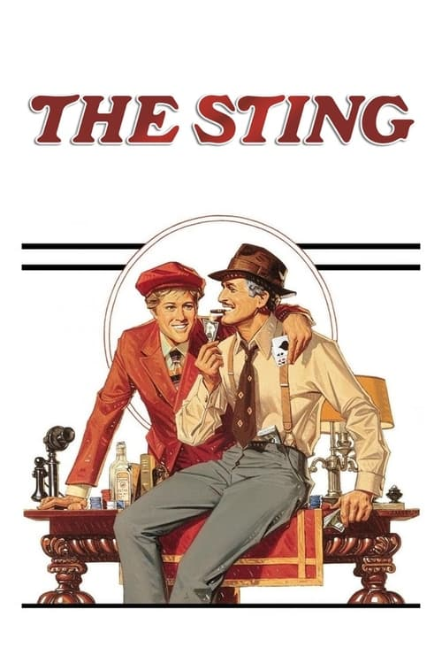
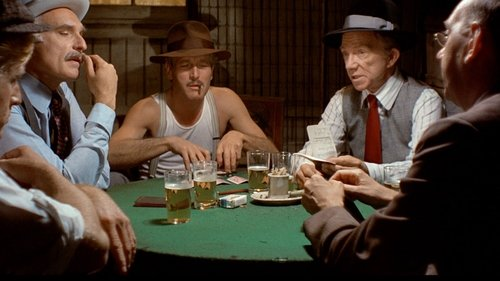

<nav class="films">
  <a class="prev" href="../duck-you-sucker">Previous</a>
  <a href="../">Film list</a>
  <a class="next" href="../dog-day-afternoon">Next</a>
</nav>

16 / 100

<article class="film">
  

    
    
  

  <h1>The Sting (1973)</h1>

  

    Directed by <strong>George Roy Hill</strong>
  

  <h2>
    Cast
  </h2>
  <ul>
    <li><strong>Paul Newman</strong> as <em>Henry Gondorff</em></li>
<li><strong>Robert Redford</strong> as <em>Johnny Hooker</em></li>
<li><strong>Robert Shaw</strong> as <em>Doyle Lonnegan</em></li>
<li><strong>Charles Durning</strong> as <em>Lt. Wm. Snyder</em></li>
<li><strong>Ray Walston</strong> as <em>J.J. Singleton</em></li>
<li><strong>Eileen Brennan</strong> as <em>Billie</em></li>
<li><strong>Harold Gould</strong> as <em>Kid Twist</em></li>
<li><strong>John Heffernan</strong> as <em>Eddie Niles</em></li>
<li><strong>Dana Elcar</strong> as <em>F.B.I. Agent Polk</em></li>
<li><strong>Jack Kehoe</strong> as <em>Erie Kid</em></li>
<li><strong>Dimitra Arliss</strong> as <em>Loretta</em></li>
<li><strong>Robert Earl Jones</strong> as <em>Luther Coleman</em></li>
<li><strong>James Sloyan</strong> as <em>Mottola</em></li>
<li><strong>Charles Dierkop</strong> as <em>Floyd (Bodyguard)</em></li>
<li><strong>Lee Paul</strong> as <em>Bodyguard</em></li>
<li><strong>Sally Kirkland</strong> as <em>Crystal</em></li>
<li><strong>Avon Long</strong> as <em>Benny Garfield</em></li>
<li><strong>Arch Johnson</strong> as <em>Combs</em></li>
<li><strong>Ed Bakey</strong> as <em>Granger</em></li>
<li><strong>Brad Sullivan</strong> as <em>Cole</em></li>
<li><strong>John Quade</strong> as <em>Riley</em></li>
<li><strong>Larry D. Mann</strong> as <em>Train Conductor</em></li>
<li><strong>Leonard Barr</strong> as <em>Burlesque House Comedian</em></li>
<li><strong>Paulene Myers</strong> as <em>Alva Coleman</em></li>
<li><strong>Joe Tornatore</strong> as <em>Black Gloved Gunman</em></li>
<li><strong>Jack Collins</strong> as <em>Duke Boudreau</em></li>
<li><strong>Tom Spratley</strong> as <em>Curly Jackson</em></li>
<li><strong>Kenneth O'Brien</strong> as <em>Greer</em></li>
<li><strong>Ken Sansom</strong> as <em>Western Union Executive</em></li>
<li><strong>Ta-Tanisha</strong> as <em>Louise Coleman</em></li>
<li><strong>William Benedict</strong> as <em>Roulette Dealer</em></li>
<li><strong>Robert Brubaker</strong> as <em>Bill Clayton from Pittsburgh (uncredited)</em></li>
<li><strong>Kathleen Freeman</strong> as <em>Kid Twist's Wife (uncredited)</em></li>
<li><strong>Susan French</strong> as <em>Landlady (uncredited)</em></li>
<li><strong>Bruce Kimball</strong> as <em>Lacey the Bouncer (uncredited)</em></li>
<li><strong>Alexander Lockwood</strong> as <em>Landlord (uncredited)</em></li>
<li><strong>Chuck Morrell</strong> as <em>FBI Agent Chuck (uncredited)</em></li>
<li><strong>Byron Morrow</strong> as <em>Mr. Jameson from Chicago (uncredited)</em></li>
<li><strong>Pearl Shear</strong> as <em>Lady in Phone Booth (uncredited)</em></li>
<li><strong>Arthur Tovey</strong> as <em>Bank Officer (uncredited)</em></li>
<li><strong>Guy Way</strong> as <em>Gambling Den Boss (uncredited)</em></li>
<li><strong>Jim Michael</strong> as <em>Bartender (uncredited)</em></li>
  </ul>
</article>
<footer>
  <a href="../about">About this list</a>
</footer>
