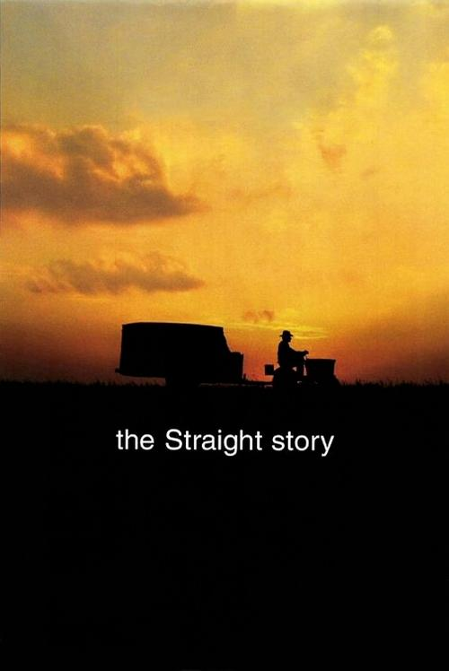



<nav class="films">
  <a class="prev" href="../fight-club-1999">Previous</a>
  <a href="../">Film list</a>
  <a class="next" href="../magnolia-1999">Next</a>
</nav>

41 / 100

<article class="film">
  

    
    
  

  <h1>The Straight Story ({{ film | filmYear }})</h1>

  

    Directed by <strong>{{ film | directors }}</strong>
  

  <h2>
    Cast
  </h2>
  <ul>
            <li><strong>Richard Farnsworth</strong> as <em>Alvin</em></li>
        <li><strong>Sissy Spacek</strong> as <em>Rose</em></li>
        <li><strong>Jane Galloway Heitz</strong> as <em>Dorothy</em></li>
        <li><strong>Joseph A. Carpenter</strong> as <em>Bud</em></li>
        <li><strong>Donald Wiegert</strong> as <em>Sig</em></li>
        <li><strong>Tracey Maloney</strong> as <em>Nurse</em></li>
        <li><strong>Dan Flannery</strong> as <em>Doctor Gibbons</em></li>
        <li><strong>Jennifer Edwards</strong> as <em>Brenda</em></li>
        <li><strong>Ed Grennan</strong> as <em>Pete</em></li>
        <li><strong>Jack Walsh</strong> as <em>Apple</em></li>
        <li><strong>Gil Pearson</strong> as <em>Bus Driver</em></li>
        <li><strong>Barbara June Patterson</strong> as <em>Woman on Bus</em></li>
        <li><strong>Everett McGill</strong> as <em>Tom the John Deere Dealer</em></li>
        <li><strong>Anastasia Webb</strong> as <em>Crystal</em></li>
        <li><strong>Matt Guidry</strong> as <em>Steve</em></li>
        <li><strong>Bill McCallum</strong> as <em>Rat</em></li>
        <li><strong>Barbara E. Robertson</strong> as <em>Deer Woman</em></li>
        <li><strong>James Cada</strong> as <em>Danny Riordan</em></li>
        <li><strong>Sally Wingert</strong> as <em>Darla Riordan</em></li>
        <li><strong>Barbara Kingsley</strong> as <em>Janet Johnson</em></li>
        <li><strong>Jim Haun</strong> as <em>Johnny Johnson</em></li>
        <li><strong>Wiley Harker</strong> as <em>Verlyn Heller</em></li>
        <li><strong>Randy Wiedenhoff</strong> as <em>Fireman #1</em></li>
        <li><strong>Jerry E. Anderson</strong> as <em>Fireman #2</em></li>
        <li><strong>Kevin Farley</strong> as <em>Harald</em></li>
        <li><strong>John Farley</strong> as <em>Thorvald</em></li>
        <li><strong>John Lordan</strong> as <em>Priest</em></li>
        <li><strong>Garrett Sweeney</strong> as <em>Boy in Truck</em></li>
        <li><strong>Peter Sweeney</strong> as <em>Boy in Truck</em></li>
        <li><strong>Tommy Fahey</strong> as <em>Boy in Truck</em></li>
        <li><strong>Matt Fahey</strong> as <em>Boy in Truck</em></li>
        <li><strong>Dan Fahey</strong> as <em>Boy in Truck</em></li>
        <li><strong>Russ Reed</strong> as <em>Mt. Zion Bartender</em></li>
        <li><strong>Leroy Swadley</strong> as <em>Bar Patron</em></li>
        <li><strong>Ralph Feldhacker</strong> as <em>Farmer on Tractor</em></li>
        <li><strong>Harry Dean Stanton</strong> as <em>Lyle</em></li>
  </ul>
</article>
<footer>
  <a href="../about">About this list</a>
</footer>
