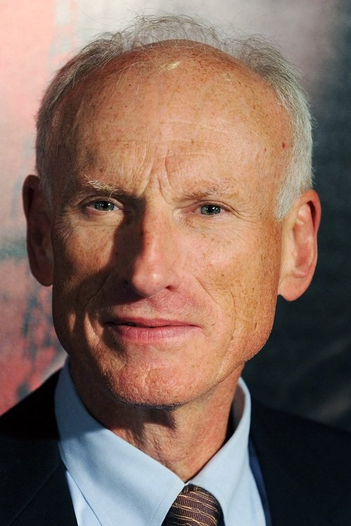
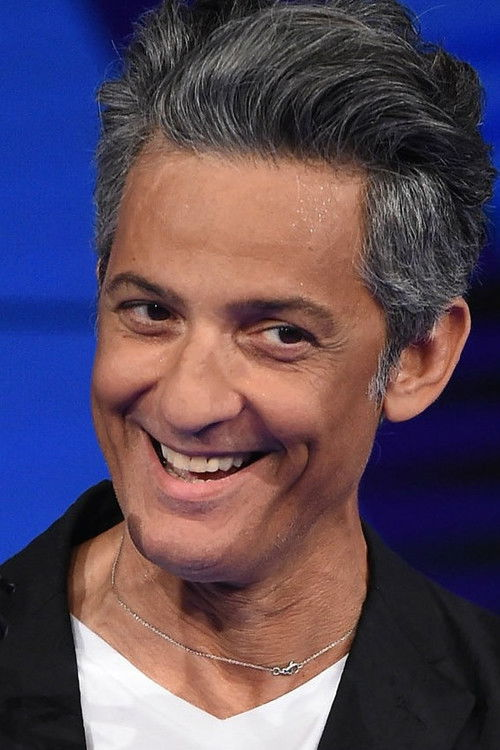



<nav class="films">
  

    <a href="../the-straight-story-1999"><i class="fa-solid fa-chevron-left fa-xs"></i> Previous</a>
  

  

    <a class="simple" href="../">36 / 100</a>
  

  

    <a href="../billy-elliot-2000">Next <i class="fa-solid fa-chevron-right fa-xs"></i></a>
  

  

    
      Previous film:
      The Straight Story
    
    
      Next film:
      Billy Elliot
    
  

</nav>

<article class="film slug-the-talented-mr-ripley-1999">
  

    
    
  

  <h1>{{ film.title }} ({{ film | filmYear }})</h1>

  

    Language: {{ film.language }}.
    
  

  

    Directed by <strong>{{ film | directors }}</strong>
  

  
    <blockquote>
      {{ films.reviews[slug] | safe }} <em>—&nbsp;<a href="/bill">Bill</a></em>
    </blockquote>
  

  <section class="cast-grid">
  

    

  
  

    Matt Damon
    Tom Ripley
  

    

  
  

    Gwyneth Paltrow
    Marge Sherwood
  

    

  
  

    Jude Law
    Dickie Greenleaf
  

    

  
  

    Cate Blanchett
    Meredith Logue
  

    

  
  

    Philip Seymour Hoffman
    Freddie Miles
  

    

  
  

    Jack Davenport
    Peter Smith-Kingsley
  

    

  
  

    James Rebhorn
    Herbert Greenleaf
  

    

  
  

    Sergio Rubini
    Inspector Roverini
  

    

  
  

    Philip Baker Hall
    Alvin MacCarron
  

    

  
  

    Celia Weston
    Aunt Joan
  

    

  
  

    Fiorello
    Fausto
  

    

  
  

    Stefania Rocca
    Silvana
  

  

</section>

  <section class="film-detail">
    

      

        

          <i class="fa-solid fa-masks-theater"></i>
          Cast
        

        <ul>
          
            <li>
              {{ cast.name }} as <em>{{ cast.character }}</em>
            </li>
          
        </ul>
      

      

        

          <i class="fa-solid fa-clapperboard"></i>
          Crew
        

        <ul>
          
            <li>
              {{ crew.name }} &mdash; <em>{{ crew.job }}</em>
            </li>
          
        </ul>
      

    

  </section>

  <section class="related-films">
  <h2>Related films</h2>
  <ul>
    <li><a href="../good-will-hunting-1997">Good Will Hunting</a> and <a href="../the-bourne-identity-2002">The Bourne Identity</a> because of Matt Damon</li>
<li><a href="../the-big-lebowski-1998">The Big Lebowski</a> because of Philip Seymour Hoffman</li>
<li><a href="../magnolia-1999">Magnolia</a> because of Philip Seymour Hoffman and Philip Baker Hall</li>
<li><a href="../the-grand-budapest-hotel-2014">The Grand Budapest Hotel</a> because of Jude Law</li>
<li><a href="../hot-fuzz-2007">Hot Fuzz</a> because of Cate Blanchett</li>
<li><a href="../house-of-gucci-2021">House of Gucci</a> because of Pietro Ragusa</li>
  </ul>
</section>

</article>
