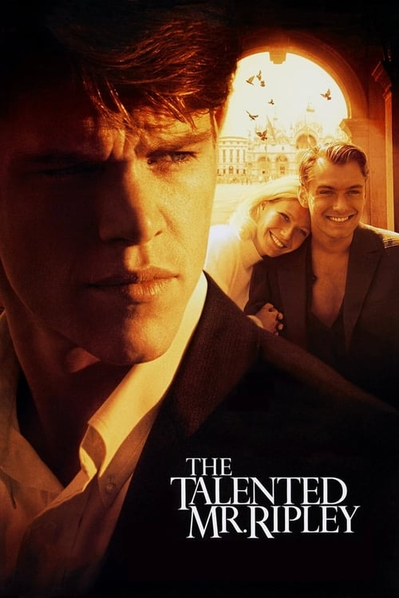

<nav class="films">
  <a class="prev" href="../magnolia">Previous</a>
  <a href="../">Film list</a>
  <a class="next" href="../billy-elliot">Next</a>
</nav>

43 / 100

<article class="film">
  <h1>The Talented Mr. Ripley (1999)</h1>

  

    Directed by <strong>Anthony Minghella</strong>
  

  

  <h2>
    Cast
  </h2>
  <ul>
    <li><strong>Matt Damon</strong> as <em>Tom Ripley</em></li>
<li><strong>Gwyneth Paltrow</strong> as <em>Marge Sherwood</em></li>
<li><strong>Jude Law</strong> as <em>Dickie Greenleaf</em></li>
<li><strong>Cate Blanchett</strong> as <em>Meredith Logue</em></li>
<li><strong>Philip Seymour Hoffman</strong> as <em>Freddie Miles</em></li>
<li><strong>Jack Davenport</strong> as <em>Peter Smith-Kingsley</em></li>
<li><strong>James Rebhorn</strong> as <em>Herbert Greenleaf</em></li>
<li><strong>Sergio Rubini</strong> as <em>Inspector Roverini</em></li>
<li><strong>Philip Baker Hall</strong> as <em>Alvin MacCarron</em></li>
<li><strong>Celia Weston</strong> as <em>Aunt Joan</em></li>
<li><strong>Fiorello</strong> as <em>Fausto</em></li>
<li><strong>Stefania Rocca</strong> as <em>Silvana</em></li>
<li><strong>Ivano Marescotti</strong> as <em>Colonnello Verrecchia</em></li>
<li><strong>Anna Longhi</strong> as <em>Signora Buffi</em></li>
<li><strong>Alessandro Fabrizi</strong> as <em>Sergeant Baggio</em></li>
<li><strong>Lisa Eichhorn</strong> as <em>Emily Greenleaf</em></li>
<li><strong>Gretchen Egolf</strong> as <em>Fran</em></li>
<li><strong>Jack Willis</strong> as <em>Greenleaf Chaffeur</em></li>
<li><strong>Frederick Alexander Bosche</strong> as <em>Fran's Boyfriend</em></li>
<li><strong>Dario Bergesio</strong> as <em>Police Officer</em></li>
<li><strong>Larry Kaplan</strong> as <em>Uncle Ted</em></li>
<li><strong>Claire Hardwick</strong> as <em>Gucci Assistant</em></li>
<li><strong>Antonio Prester</strong> as <em>American Express Clerk</em></li>
<li><strong>Lorenzo Mancuso</strong> as <em>Bus Driver</em></li>
<li><strong>Onofrio Mancuso</strong> as <em>Priest</em></li>
<li><strong>Massimo Reale</strong> as <em>Immigration Officer</em></li>
<li><strong>Emanuele Carucci Viterbi</strong> as <em>American Express Clerk</em></li>
<li><strong>Caterina Deregibus</strong> as <em>Dahlia</em></li>
<li><strong>Silvana Bosi</strong> as <em>Ermelinda</em></li>
<li><strong>Gianfranco Barra</strong> as <em>Desk Manager Aldo</em></li>
<li><strong>Renato Scarpa</strong> as <em>Tailor</em></li>
<li><strong>Deirdre Lovejoy</strong> as <em>Fighting Neighbor</em></li>
<li><strong>Brian Tarantina</strong> as <em>Fighting Neighbor</em></li>
<li><strong>Guy Barker</strong> as <em>Trumpet (Napoli Jazz Septet)</em></li>
<li><strong>Bernardo Sassetti</strong> as <em>Piano (Napoli Jazz Septet)</em></li>
<li><strong>Perico Sambeat</strong> as <em>Alto Sax (Napoli Jazz Septet)</em></li>
<li><strong>Gene Calderazzo</strong> as <em>Drums (Napoli Jazz Septet) mer</em></li>
<li><strong>Joseph Lepore</strong> as <em>Double Bass (Napoli Jazz Septet)</em></li>
<li><strong>Rosario Giuliuni</strong> as <em>Tenor Sax (Napoli Jazz Septet)</em></li>
<li><strong>Eddy Palerno</strong> as <em>Electric Guitar (Napoli Jazz Septet)</em></li>
<li><strong>Byron Wallen</strong> as <em>Cornet (San Remo Jazz Sextet)</em></li>
<li><strong>Pete King</strong> as <em>Alto Sax (San Remo Jazz Sextet)</em></li>
<li><strong>Clark Tracey</strong> as <em>Drums (San Remo Jazz Sextet)</em></li>
<li><strong>Jean Toussaint</strong> as <em>Tenor Sax (San Remo Jazz Sextet)</em></li>
<li><strong>Geoff Gascoyne</strong> as <em>Bass (San Remo Jazz Sextet)</em></li>
<li><strong>Carlo Negroni</strong> as <em>Piano (San Remo Jazz Sextet)</em></li>
<li><strong>Giuseppe Fiorello</strong> as <em>Silvana's Fiancé</em></li>
<li><strong>Marco Quaglia</strong> as <em>Silvana's Brother</em></li>
<li><strong>Alessandra Vanzi</strong> as <em>Silvana's Mother</em></li>
<li><strong>Marco Rossi</strong> as <em>Photographer</em></li>
<li><strong>Roberto Valentini</strong> as <em>Onegin (Eugene Onegin Player)</em></li>
<li><strong>Francesco Bovino</strong> as <em>Lensky (Eugene Onegin Player)</em></li>
<li><strong>Stefano Canettieri</strong> as <em>Zaretsky (Eugene Onegin Player)</em></li>
<li><strong>Marco Foti</strong> as <em>Guillot (Eugene Onegin Player)</em></li>
<li><strong>Ludovica Tinghi</strong> as <em>Fausto's Fiancée</em></li>
<li><strong>Nicola Pannelli</strong> as <em>Dinelli's Cafe Waiter</em></li>
<li><strong>Paolo Calabresi</strong> as <em>Customs Officer</em></li>
<li><strong>Pietro Ragusa</strong> as <em>Record Store Owner</em></li>
<li><strong>Simone Empler</strong> as <em>Boy Singer</em></li>
<li><strong>Gianluca Secci</strong> as <em>Policeman</em></li>
<li><strong>Manuel Ruffini</strong> as <em>Policeman</em></li>
<li><strong>Pierpaolo Lovino</strong> as <em>Policeman</em></li>
<li><strong>Roberto Di Palma</strong> as <em>San Remo Hotel Desk Clerk</em></li>
<li><strong>Dominic Fumusa</strong> as <em>Italian Boy in Rome (uncredited)</em></li>
  </ul>
</article>
<footer>
  <a href="../about">About this list</a>
</footer>
