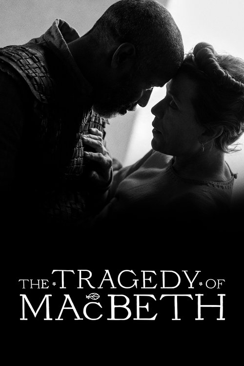

<nav class="films">
  <a class="prev" href="../licorice-pizza">Previous</a>
  <a href="../">Film list</a>
  <a class="next" href="../between-two-worlds">Next</a>
</nav>

90 / 100

<article class="film">
  

    
    
  

  <h1>The Tragedy of Macbeth (2021)</h1>

  

    Directed by <strong>Joel Coen</strong>
  

  <h2>
    Cast
  </h2>
  <ul>
    <li><strong>Denzel Washington</strong> as <em>Macbeth</em></li>
<li><strong>Frances McDormand</strong> as <em>Lady Macbeth</em></li>
<li><strong>Alex Hassell</strong> as <em>Ross</em></li>
<li><strong>Bertie Carvel</strong> as <em>Banquo</em></li>
<li><strong>Brendan Gleeson</strong> as <em>Duncan</em></li>
<li><strong>Corey Hawkins</strong> as <em>Macduff</em></li>
<li><strong>Harry Melling</strong> as <em>Malcolm</em></li>
<li><strong>Miles Anderson</strong> as <em>Lennox</em></li>
<li><strong>Kathryn Hunter</strong> as <em>Witches / Old Man</em></li>
<li><strong>Matt Helm</strong> as <em>Donalbain</em></li>
<li><strong>Moses Ingram</strong> as <em>Lady Macduff</em></li>
<li><strong>Scott Subiono</strong> as <em>Murderer</em></li>
<li><strong>Brian Thompson</strong> as <em>Murderer</em></li>
<li><strong>Lucas Barker</strong> as <em>Fleance</em></li>
<li><strong>Stephen Root</strong> as <em>Porter</em></li>
<li><strong>Robert Gilbert</strong> as <em>Angus</em></li>
<li><strong>Ethan Hutchison</strong> as <em>Macduff's Son</em></li>
<li><strong>James Udom</strong> as <em>Seyton</em></li>
<li><strong>Richard Short</strong> as <em>Siward</em></li>
<li><strong>Sean Patrick Thomas</strong> as <em>Monteith</em></li>
<li><strong>Ralph Ineson</strong> as <em>Captain</em></li>
<li><strong>Jefferson Mays</strong> as <em>Doctor</em></li>
<li><strong>Olivia Washington</strong> as <em>Children’s Nurse</em></li>
<li><strong>Susan James Berger</strong> as <em>Lady in Waiting</em></li>
<li><strong>Wayne T. Carr</strong> as <em>Lady Macduff’s Murderer</em></li>
<li><strong>Jacob McCarthy</strong> as <em>Wheyface</em></li>
<li><strong>Nancy Daly</strong> as <em>Lady Macbeth's Nurse</em></li>
<li><strong>Kayden Alexander Koshelev</strong> as <em>Apparition Boy</em></li>
<li><strong>Ledger Fuller</strong> as <em>Apparition Boy</em></li>
<li><strong>T.K. Weaver</strong> as <em>Apparition Boy</em></li>
<li><strong>Edward Headington</strong> as <em>Thane of Cawdor (uncredited)</em></li>
<li><strong>Tim Oakes</strong> as <em>Duncan's Protector (uncredited)</em></li>
<li><strong>Peter Janov</strong> as <em>Soldier (uncredited)</em></li>
<li><strong>Max Baker</strong> as <em>Doctor (uncredited)</em></li>
<li><strong>Madison Randolph</strong> as <em>Macduff's Daughter (uncredited)</em></li>
<li><strong>Phil DiGennaro</strong> as <em>Demitrius (uncredited)</em></li>
  </ul>
</article>
<footer>
  <a href="../about">About this list</a>
</footer>
