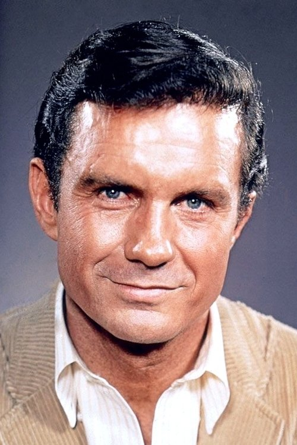
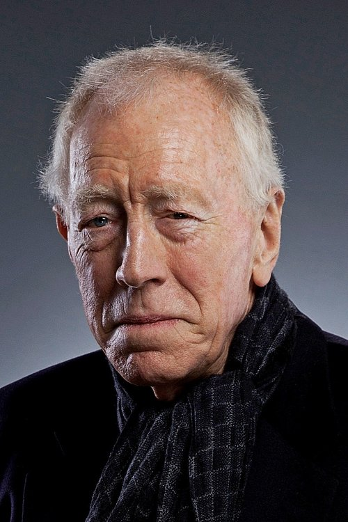
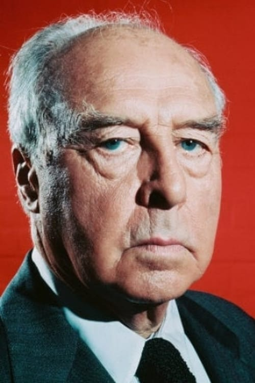



<nav class="films">
  

    <a href="../dog-day-afternoon-1975"><i class="fa-solid fa-chevron-left fa-xs"></i> Previous</a>
  

  

    <a class="simple" href="../">14 / 100</a>
  

  

    <a href="../the-man-who-fell-to-earth-1976">Next <i class="fa-solid fa-chevron-right fa-xs"></i></a>
  

  

    
      Previous film:
      Dog Day Afternoon
    
    
      Next film:
      The Man Who Fell to Earth
    
  

</nav>

<article class="film slug-three-days-of-the-condor-1975">
  

    
    
  

  <h1>{{ film.title }} ({{ film | filmYear }})</h1>

  

    Language: {{ film.language }}.
    
  

  

    Directed by <strong>{{ film | directors }}</strong>
  

  
    <blockquote>
      {{ films.reviews[slug] | safe }} <em>—&nbsp;<a href="/bill">Bill</a></em>
    </blockquote>
  

  <section class="cast-grid">
  

    

  
  

    Robert Redford
    Joseph Turner
  

    

  
  

    Faye Dunaway
    Kathy Hale
  

    

  
  

    Cliff Robertson
    J. Higgins
  

    

  
  

    Max von Sydow
    G. Joubert
  

    

  
  

    John Houseman
    Mr. Wabash
  

    

  
  

    Addison Powell
    Leonard Atwood
  

    

  
  

    Walter McGinn
    Sam Barber
  

    

  
  

    Tina Chen
    Janice Chon
  

    

  
  

    John Randolph Jones
    Beefy Man
  

    

  
  

    Michael Kane
    S.W. Wicks
  

    

  
<i class="fa-solid fa-user"></i>

  

    Don McHenry
    Dr. Ferdinand Lappe
  

    

  
<i class="fa-solid fa-user"></i>

  

    Jess Osuna
    The Major
  

  

</section>

  <section class="film-detail">
    

      

        

          <i class="fa-solid fa-masks-theater"></i>
          Cast
        

        <ul>
          
            <li>
              {{ cast.name }} as <em>{{ cast.character }}</em>
            </li>
          
        </ul>
      

      

        

          <i class="fa-solid fa-clapperboard"></i>
          Crew
        

        <ul>
          
            <li>
              {{ crew.name }} &mdash; <em>{{ crew.job }}</em>
            </li>
          
        </ul>
      

    

  </section>

  <section class="related-films">
  <h2>Related films</h2>
  <ul>
    <li><a href="../the-sting-1973">The Sting</a> and <a href="../all-is-lost-2013">All Is Lost</a> because of Robert Redford</li>
<li><a href="../apocalypse-now-1979">Apocalypse Now</a> because of James Keane</li>
  </ul>
</section>

</article>
