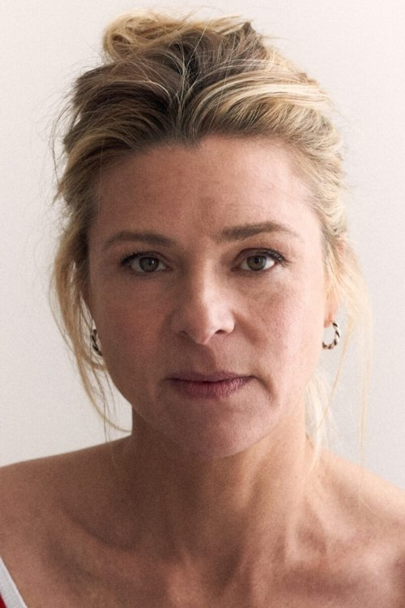
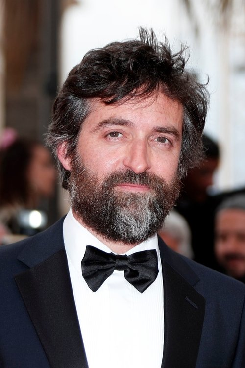



<nav class="films">
  

    <a href="../le-havre-2011"><i class="fa-solid fa-chevron-left fa-xs"></i> Previous</a>
  

  

    <a class="simple" href="../">51 / 100</a>
  

  

    <a href="../kill-bill-the-whole-bloody-affair-2011">Next <i class="fa-solid fa-chevron-right fa-xs"></i></a>
  

  

    
      Previous film:
      Le Havre
    
    
      Next film:
      Kill Bill: The Whole Bloody Affair
    
  

</nav>

<article class="film slug-tomboy-2011">
  

    
    
  

  <h1>{{ film.title }} ({{ film | filmYear }})</h1>

  

    Language: {{ film.language }}.
    
  

  

    Directed by <strong>{{ film | directors }}</strong>
  

  
    <blockquote>
      {{ films.reviews[slug] | safe }} <em>—&nbsp;<a href="/bill">Bill</a></em>
    </blockquote>
  

  <section class="cast-grid">
  

    

  
  

    Zoé Héran
    Laure / Mickaël
  

    

  
  

    Malonn Lévana
    Jeanne
  

    

  
  

    Jeanne Disson
    Lisa
  

    

  
  

    Sophie Cattani
    La mère
  

    

  
  

    Mathieu Demy
    Le père
  

    

  
<i class="fa-solid fa-user"></i>

  

    Rayan Boubekri
    Rayan
  

    

  
<i class="fa-solid fa-user"></i>

  

    Yohan Vero
    Vince
  

    

  
  

    Noah Vero
    Noah
  

    

  
<i class="fa-solid fa-user"></i>

  

    Cheyenne Lainé
    Cheyenne
  

    

  
  

    Christel Baras
    La mère de Lisa
  

    

  
<i class="fa-solid fa-user"></i>

  

    Valérie Roucher
    La mère de Rayan
  

  

</section>

  <section class="film-detail">
    

      

        

          <i class="fa-solid fa-masks-theater"></i>
          Cast
        

        <ul>
          
            <li>
              {{ cast.name }} as <em>{{ cast.character }}</em>
            </li>
          
        </ul>
      

      

        

          <i class="fa-solid fa-clapperboard"></i>
          Crew
        

        <ul>
          
            <li>
              {{ crew.name }} &mdash; <em>{{ crew.job }}</em>
            </li>
          
        </ul>
      

    

  </section>

  <section class="related-films">
  <h2>Related films</h2>
  <ul>
    <li><a href="../portrait-of-a-lady-on-fire-2019">Portrait of a Lady on Fire</a> because of Christel Baras and Céline Sciamma</li>
<li><a href="../petite-maman-2021">Petite Maman</a> because of Céline Sciamma</li>
  </ul>
</section>

</article>
