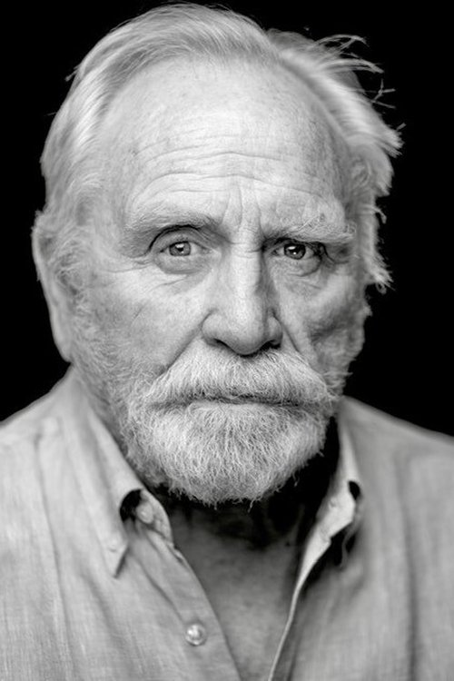



<nav class="films">
  

    <a href="../fargo-1996"><i class="fa-solid fa-chevron-left fa-xs"></i> Previous</a>
  

  

    <a class="simple" href="../">29 / 100</a>
  

  

    <a href="../good-will-hunting-1997">Next <i class="fa-solid fa-chevron-right fa-xs"></i></a>
  

  

    
      Previous film:
      Fargo
    
    
      Next film:
      Good Will Hunting
    
  

</nav>

<article class="film slug-trainspotting-1996">
  

    
    
  

  <h1>{{ film.title }} ({{ film | filmYear }})</h1>

  

    Language: {{ film.language }}.
    
  

  

    Directed by <strong>{{ film | directors }}</strong>
  

  
    <blockquote>
      {{ films.reviews[slug] | safe }} <em>—&nbsp;<a href="/bill">Bill</a></em>
    </blockquote>
  

  <section class="cast-grid">
  

    

  
  

    Ewan McGregor
    Renton
  

    

  
  

    Ewen Bremner
    Spud
  

    

  
  

    Jonny Lee Miller
    Sick Boy
  

    

  
  

    Kevin McKidd
    Tommy
  

    

  
  

    Robert Carlyle
    Begbie
  

    

  
  

    Kelly Macdonald
    Diane
  

    

  
  

    Peter Mullan
    Swanney
  

    

  
  

    James Cosmo
    Renton's Father
  

    

  
  

    Eileen Nicholas
    Renton's Mother
  

    

  
  

    Susan Vidler
    Allison
  

    

  
  

    Pauline Lynch
    Lizzy
  

    

  
  

    Shirley Henderson
    Gail
  

  

</section>

  <section class="film-detail">
    

      

        

          <i class="fa-solid fa-masks-theater"></i>
          Cast
        

        <ul>
          
            <li>
              {{ cast.name }} as <em>{{ cast.character }}</em>
            </li>
          
        </ul>
      

      

        

          <i class="fa-solid fa-clapperboard"></i>
          Crew
        

        <ul>
          
            <li>
              {{ crew.name }} &mdash; <em>{{ crew.job }}</em>
            </li>
          
        </ul>
      

    

  </section>

  <section class="related-films">
  <h2>Related films</h2>
  <ul>
    <li><a href="../shallow-grave-1994">Shallow Grave</a> because of Ewan McGregor, Keith Allen, Peter Mullan, Victor Eadie, Billy Riddoch and Danny Boyle</li>
<li><a href="../black-hawk-down-2001">Black Hawk Down</a> because of Ewan McGregor and Ewen Bremner</li>
<li><a href="../24-hour-party-people-2002">24 Hour Party People</a> because of Keith Allen and Shirley Henderson</li>
<li><a href="../no-country-for-old-men-2007">No Country for Old Men</a> because of Kelly Macdonald</li>
<li><a href="../mr-turner-2014">Mr. Turner</a> because of Stuart McQuarrie</li>
  </ul>
</section>

</article>
