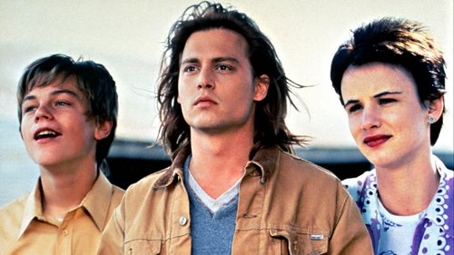

<nav class="films">
  <a class="prev" href="../the-fugitive">Previous</a>
  <a href="../">Film list</a>
  <a class="next" href="../four-weddings-and-a-funeral">Next</a>
</nav>

33 / 100

<article class="film">
  

    
    
  

  <h1>What's Eating Gilbert Grape (1993)</h1>

  

    Directed by <strong>Lasse Hallström</strong>
  

  <h2>
    Cast
  </h2>
  <ul>
    <li><strong>Johnny Depp</strong> as <em>Gilbert Grape</em></li>
<li><strong>Juliette Lewis</strong> as <em>Becky</em></li>
<li><strong>Leonardo DiCaprio</strong> as <em>Arnie Grape</em></li>
<li><strong>Mary Steenburgen</strong> as <em>Betty Carver</em></li>
<li><strong>Darlene Cates</strong> as <em>Bonnie Grape</em></li>
<li><strong>Laura Harrington</strong> as <em>Amy Grape</em></li>
<li><strong>Mary Kate Schellhardt</strong> as <em>Ellen Grape</em></li>
<li><strong>Kevin Tighe</strong> as <em>Ken Carver</em></li>
<li><strong>John C. Reilly</strong> as <em>Tucker Van Dyke</em></li>
<li><strong>Crispin Glover</strong> as <em>Bobby McBurney</em></li>
<li><strong>Penelope Branning</strong> as <em>Becky's Grandma</em></li>
<li><strong>Tim Green</strong> as <em>Mr. Lamson</em></li>
<li><strong>Susan Loughran</strong> as <em>Mrs. Lamson</em></li>
<li><strong>Robert B. Hedges</strong> as <em>Minister</em></li>
<li><strong>Mark Jordan</strong> as <em>Todd Carver</em></li>
<li><strong>Cameron Finley</strong> as <em>Doug Carver</em></li>
<li><strong>Brady Coleman</strong> as <em>Sheriff Jerry Farrel</em></li>
<li><strong>Tim Simek</strong> as <em>Deputy</em></li>
<li><strong>Nicholas Stojanovich</strong> as <em>Boy #1</em></li>
<li><strong>Libby Villari</strong> as <em>Waitress</em></li>
<li><strong>Kay Bower</strong> as <em>Police Secretary</em></li>
<li><strong>Joe Stevens</strong> as <em>Burger Barn Manager</em></li>
<li><strong>Mona Lee Fultz</strong> as <em>Bakery Worker</em></li>
<li><strong>George Haynes</strong> as <em>Dave</em></li>
<li><strong>Daniel Gullahorn</strong> as <em>Boy #2</em></li>
<li><strong>David H. Kramer</strong> as <em>Group (voice)</em></li>
<li><strong>Brent Bratton</strong> as <em>Burger Barn Employee (uncredited)</em></li>
<li><strong>Kirk Hunter</strong> as <em>Townfolk (uncredited)</em></li>
<li><strong>Buck Reynolds</strong> as <em>Juvenile Heckler (uncredited)</em></li>
<li><strong>David Stanford</strong> as <em>Townsperson (uncredited)</em></li>
  </ul>
</article>
<footer>
  <a href="../about">About this list</a>
</footer>
