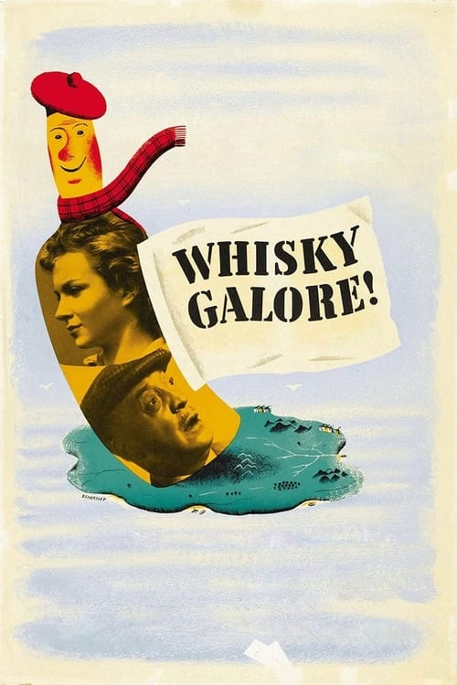
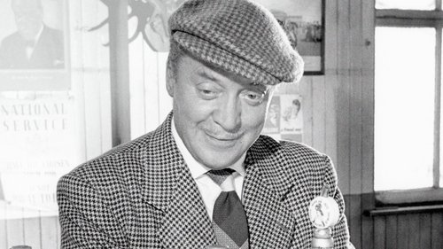



<nav class="films">
  <a class="prev" href="../its-a-wonderful-life-1946">Previous</a>
  <a href="../">Film list</a>
  <a class="next" href="../la-strada-1954">Next</a>
</nav>

2 / 100

<article class="film">
  

    
    
  

  <h1>Whisky Galore! ({{ film | filmYear }})</h1>

  

  

    Directed by <strong>{{ film | directors }}</strong>
  

  <h2>
    Cast
  </h2>
  <ul>
            <li><strong>Basil Radford</strong> as <em>Captain Paul Waggett</em></li>
        <li><strong>Bruce Seton</strong> as <em>Sergeant Odd</em></li>
        <li><strong>Gordon Jackson</strong> as <em>George Campbell</em></li>
        <li><strong>Wylie Watson</strong> as <em>Joseph Macroon</em></li>
        <li><strong>Morland Graham</strong> as <em>The Biffer</em></li>
        <li><strong>John Gregson</strong> as <em>Sammy MacCodrun</em></li>
        <li><strong>Joan Greenwood</strong> as <em>Peggy Macroon</em></li>
        <li><strong>Gabrielle Blunt</strong> as <em>Catriona Macroon</em></li>
        <li><strong>Catherine Lacey</strong> as <em>Mrs. Waggett</em></li>
        <li><strong>Jean Cadell</strong> as <em>Mrs. Campbell</em></li>
        <li><strong>James Robertson Justice</strong> as <em>Dr. Maclaren</em></li>
        <li><strong>James Woodburn</strong> as <em>Roderick MacRurie</em></li>
        <li><strong>Jameson Clark</strong> as <em>Constable Macrae</em></li>
        <li><strong>Duncan Macrae</strong> as <em>Angus MacCormac</em></li>
        <li><strong>Mary MacNeil</strong> as <em>Mrs. MacCormac</em></li>
        <li><strong>Norman MacOwan</strong> as <em>Captain MacPhee</em></li>
        <li><strong>Alastair Hunter</strong> as <em>Captain MacKechnie</em></li>
        <li><strong>Henry Mollison</strong> as <em>Mr. Farquharson</em></li>
        <li><strong>Frank Webster</strong> as <em>First Mate</em></li>
        <li><strong>Compton MacKenzie</strong> as <em>Captain Buncher</em></li>
        <li><strong>James Anderson</strong> as <em>Old Hector</em></li>
        <li><strong>Cyril Chamberlain</strong> as <em></em></li>
        <li><strong>Finlay Currie</strong> as <em>Narrator</em></li>
        <li><strong>A.E. Matthews</strong> as <em>Colonel Linsey-Woolsey</em></li>
  </ul>
</article>
<footer>
  <a href="../about">About this list</a>
</footer>
