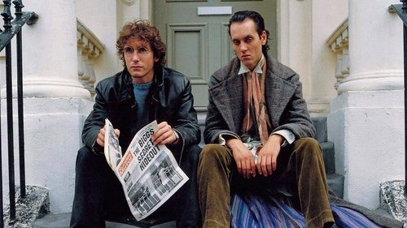

<nav class="films">
  <a class="prev" href="../brazil">Previous</a>
  <a href="../">Film list</a>
  <a class="next" href="../delicatessen">Next</a>
</nav>

29 / 100

<article class="film">
  
  

  <h1>Withnail & I (1987)</h1>

  

    Directed by <strong>Bruce Robinson</strong>
  

  <h2>
    Cast
  </h2>
  <ul>
    <li><strong>Richard E. Grant</strong> as <em>Withnail</em></li>
<li><strong>Paul McGann</strong> as <em>...& I</em></li>
<li><strong>Richard Griffiths</strong> as <em>Monty</em></li>
<li><strong>Ralph Brown</strong> as <em>Danny</em></li>
<li><strong>Michael Elphick</strong> as <em>Jake</em></li>
<li><strong>Daragh O'Malley</strong> as <em>Irishman</em></li>
<li><strong>Michael Wardle</strong> as <em>Isaac Parkin</em></li>
<li><strong>Una Brandon-Jones</strong> as <em>Mrs. Parkin</em></li>
<li><strong>Noel Johnson</strong> as <em>General</em></li>
<li><strong>Irene Sutcliffe</strong> as <em>Waitress</em></li>
<li><strong>Llewellyn Rees</strong> as <em>Tea Shop Proprietor</em></li>
<li><strong>Robert Oates</strong> as <em>Policeman 1</em></li>
<li><strong>Anthony Wise</strong> as <em>Policeman 2</em></li>
<li><strong>Eddie Tagoe</strong> as <em>Presuming Ed</em></li>
  </ul>
</article>
<footer>
  <a href="../about">About this list</a>
</footer>
