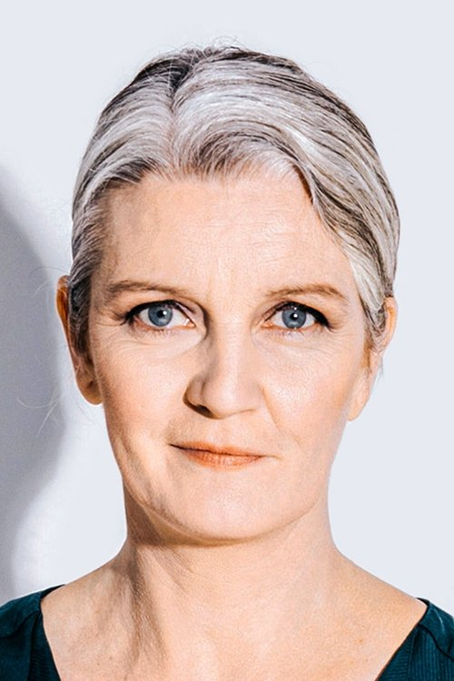



<nav class="films">
  

    <a href="../sink-or-swim-2018"><i class="fa-solid fa-chevron-left fa-xs"></i> Previous</a>
  

  

    <a class="simple" href="../">66 / 100</a>
  

  

    <a href="../little-women-2019">Next <i class="fa-solid fa-chevron-right fa-xs"></i></a>
  

  

    
      Previous film:
      Sink or Swim
    
    
      Next film:
      Little Women
    
  

</nav>

<article class="film slug-woman-at-war-2018">
  

    
    
  

  <h1>{{ film.title }} ({{ film | filmYear }})</h1>

  

    Language: {{ film.language }}.
    Also known as Kona fer í stríð.
  

  

    Directed by <strong>{{ film | directors }}</strong>
  

  
    <blockquote>
      {{ films.reviews[slug] | safe }} <em>—&nbsp;<a href="/bill">Bill</a></em>
    </blockquote>
  

  <section class="cast-grid">
  

    

  
  

    Halldóra Geirharðsdóttir
    Halla / Ása
  

    

  
  

    Jóhann Sigurðarson
    Sveinbjörn
  

    

  
  

    Davíð Þór Jónsson
    Pianist / Accordion Player
  

    

  
  

    Magnús Trygvason Eliassen
    Drummer
  

    

  
<i class="fa-solid fa-user"></i>

  

    Ómar Guðjónsson
    Sousaphone Player
  

    

  
<i class="fa-solid fa-user"></i>

  

    Iryna Danyleiko
    Ukrainian Choir Singer
  

    

  
<i class="fa-solid fa-user"></i>

  

    Galyna Goncharenko
    Ukrainian Choir Singer
  

    

  
<i class="fa-solid fa-user"></i>

  

    Susanna Kurpenko
    Ukrainian Choir Singer
  

    

  
  

    Jörundur Ragnarsson
    Baldvin
  

    

  
  

    Juan Camillo Roman Estrada
    Juan Camillo
  

    

  
  

    Charlotte Bøving
    Adoption agency lady
  

    

  
  

    Björn Thors
    The Prime Minister
  

  

</section>

  <section class="film-detail">
    

      

        

          <i class="fa-solid fa-masks-theater"></i>
          Cast
        

        <ul>
          
            <li>
              {{ cast.name }} as <em>{{ cast.character }}</em>
            </li>
          
        </ul>
      

      

        

          <i class="fa-solid fa-clapperboard"></i>
          Crew
        

        <ul>
          
            <li>
              {{ crew.name }} &mdash; <em>{{ crew.job }}</em>
            </li>
          
        </ul>
      

    

  </section>

  
</article>
