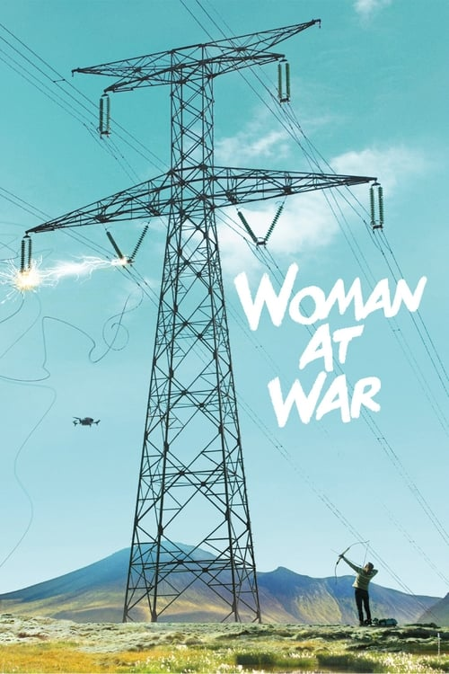

<a href="../">Back to all films</a>

<article class="film">
  <h1>Woman at War (2018)</h1>

  

    Directed by <strong>Benedikt Erlingsson</strong>
  

  

  <h2>
    Cast
  </h2>
  <ul>
    <li><strong>Halldóra Geirharðsdóttir</strong> as <em>Halla / Ása</em></li>
<li><strong>Jóhann Sigurðarson</strong> as <em>Sveinbjörn</em></li>
<li><strong>Davíð Þór Jónsson</strong> as <em>Pianist / Accordion Player</em></li>
<li><strong>Magnús Trygvason Eliassen</strong> as <em>Drummer</em></li>
<li><strong>Ómar Guðjónsson</strong> as <em>Sousaphone Player</em></li>
<li><strong>Iryna Danyleiko</strong> as <em>Ukrainian Choir Singer</em></li>
<li><strong>Galyna Goncharenko</strong> as <em>Ukrainian Choir Singer</em></li>
<li><strong>Susanna Kurpenko</strong> as <em>Ukrainian Choir Singer</em></li>
<li><strong>Jörundur Ragnarsson</strong> as <em>Baldvin</em></li>
<li><strong>Juan Camillo Roman Estrada</strong> as <em>Juan Camillo</em></li>
<li><strong>Charlotte Bøving</strong> as <em>Adoption agency lady</em></li>
<li><strong>Björn Thors</strong> as <em>The Prime Minister</em></li>
<li><strong>Hilmir Snær Guðnason</strong> as <em>Taxi Driver</em></li>
<li><strong>Jon Johanson</strong> as <em>Greenhouse farmer</em></li>
<li><strong>Þorsteinn Guðmundsson</strong> as <em>Prison Guard</em></li>
<li><strong>Helga Braga Jónsdóttir</strong> as <em>Prison Guard</em></li>
<li><strong>Jón Gnarr</strong> as <em>President of Iceland</em></li>
<li><strong>Vala Kristín Eiríkssdóttir</strong> as <em>Stefanía</em></li>
<li><strong>Hjörleifur Hjartarsson</strong> as <em>Prime Ministers aide</em></li>
<li><strong>Albert Halldórsson</strong> as <em>Prime Ministers aide</em></li>
<li><strong>Eiríkur Stephensen</strong> as <em>Prime Ministers aide</em></li>
<li><strong>Olena Lavrenyuk</strong> as <em>Orphanage Matron</em></li>
<li><strong>Margaryta Hilska</strong> as <em>Nika</em></li>
<li><strong>Ragnheiður Steindórsdóttir</strong> as <em>Antique shop employee</em></li>
<li><strong>Sólveig Arnarsdóttir</strong> as <em>Mother of Sirrý</em></li>
<li><strong>Þórhildur Ingunn</strong> as <em>Sirrý</em></li>
<li><strong>Dominique Sigrúnardóttir</strong> as <em>Journalist</em></li>
<li><strong>Arnfinnur Daníelsson</strong> as <em>Union leader (TV 56)</em></li>
<li><strong>Haraldur Ari Stefánsson</strong> as <em>Páll Blöndal</em></li>
<li><strong>Lísa Kristjánsdóttir</strong> as <em>Woman at the airport</em></li>
<li><strong>Högni Egilsson</strong> as <em>Husband in the queue</em></li>
<li><strong>Saga Garðarsdóttir</strong> as <em>Police officer</em></li>
<li><strong>Hallgrimur Olafsson</strong> as <em>Police officer</em></li>
<li><strong>Ari Eldjárn</strong> as <em>Police officer</em></li>
<li><strong>Halldór Halldórsson</strong> as <em>Police officer</em></li>
<li><strong>Erpur Eyvindarson</strong> as <em>Helicopter policeman</em></li>
<li><strong>Sylvia Dögg Halldórsdóttir</strong> as <em>Helicopter policewoman</em></li>
  </ul>
</article>
