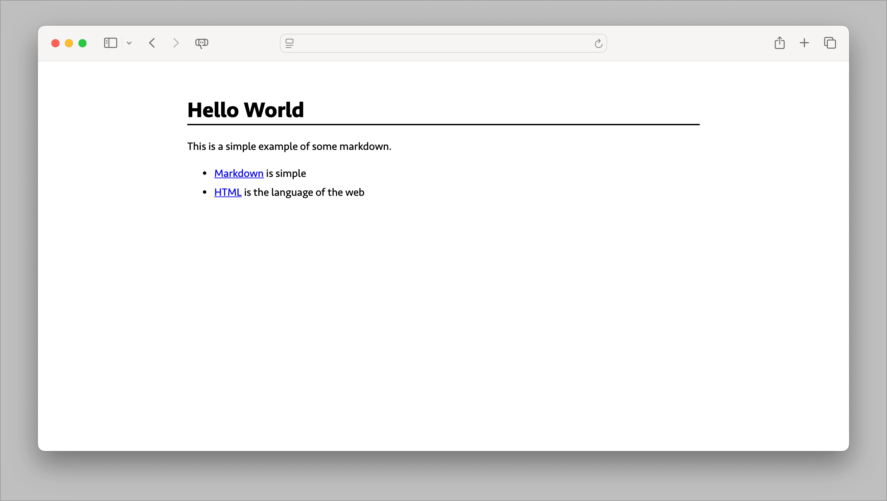
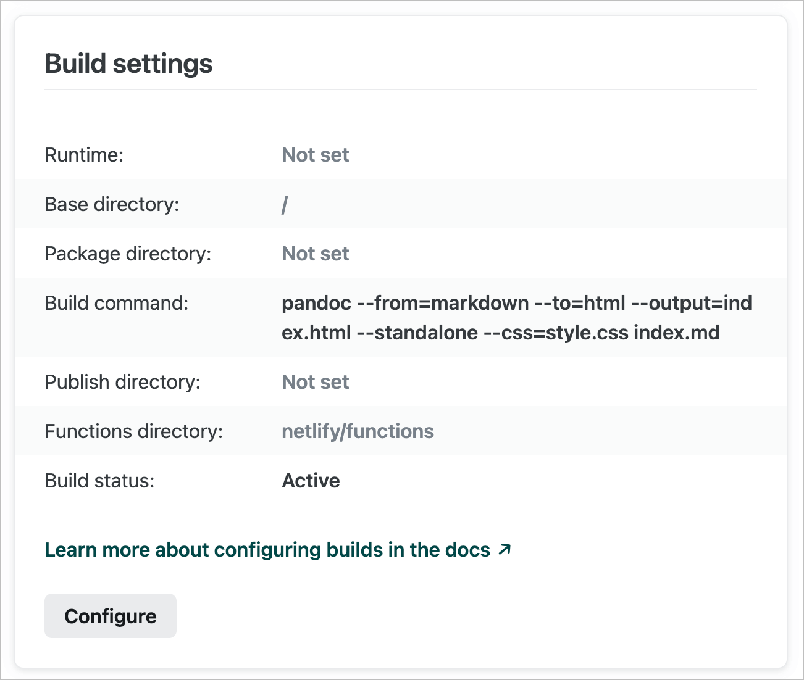

I wanted to share some markdown by publishing it as a webpage. There are a bunch of ways to do that (like the very good [HackMD](https://hackmd.io/)) but I wanted a bit more control over how it looked and fewer distracting things on the page.

## The markdown

Let's use a really simple example:

```md
# Hello World

This is a simple example of some markdown.

- [Markdown](https://daringfireball.net/projects/markdown/) is simple
- [HTML](https://developer.mozilla.org/en-US/docs/Web/HTML) is the language of the web
```

## Pandoc

Enter [Pandoc](https://pandoc.org/). It's a tool for converting markdown to other formats. It does a lot of things but I just want to convert markdown to HTML.

```sh
pandoc --from=markdown --to=html --output=index.html index.md
```

Which produces this:


## Styling

But that's not very pretty. Let's add some CSS.

```css
html {
  color-scheme: light dark;
}

body {
  font-family: Seravek, 'Gill Sans Nova', Ubuntu, Calibri, 'DejaVu Sans', source-sans-pro, sans-serif;;
  margin: 1rem auto;
  max-width: 80ch;
  padding: 1rem
}

h1 {
  border-bottom: 2px solid light-dark(black, white);
}

li {
  padding-block: 0.25rem;
}
```

And then ask Pandoc to use it:

```sh
pandoc --from=markdown --to=html --output=index.html --standalone --css=style.css index.md
```

That's better:



## Metadata

We're not quite there yet though. Pandoc gives us this warning:

```sh
[WARNING] This document format requires a nonempty <title> element.
  Defaulting to 'index' as the title.
  To specify a title, use 'title' in metadata or --metadata title="...".
```

So let's add a title to our markdown:

```md
---
title: Hello World
---

This is a simple example of some markdown.

- [Markdown](https://daringfireball.net/projects/markdown/) is simple
- [HTML](https://developer.mozilla.org/en-US/docs/Web/HTML) is the language of the web
```

If you look at the HTML source you'll see the title has been added:

```html
<title>Hello World</title>
```

Note that the template automatically adds a `<h1>` tag so you no longer need that in the markdown. To dive deeper into what Pandoc does you can look at the default HTML template it uses:

```sh
pandoc -D html
```

## Netlify

We're almost there. Now we just need to publish it to the web. There are 100 different ways to do that but I use [Netlify](https://www.netlify.com/) for this blog so let's do that. The key part is the build configuration.



That's it. An optional step is to put this in a GitHub repo and wire up automatic deploys to Netlify. Now you can edit the markdown and push a commit to [GitHub](https://github.com/) and Netlify will automatically build and publish the webpage.
