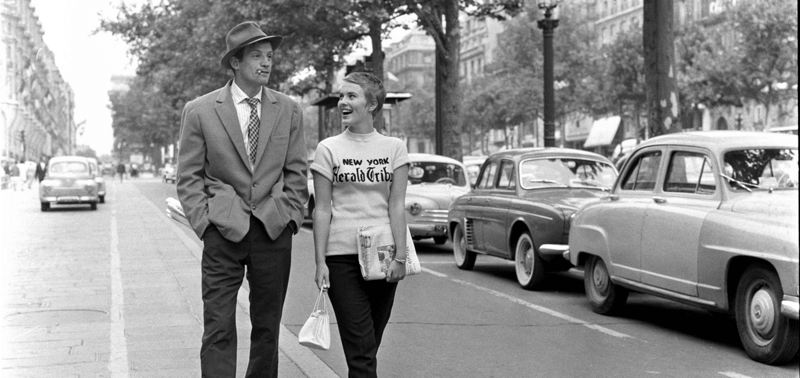
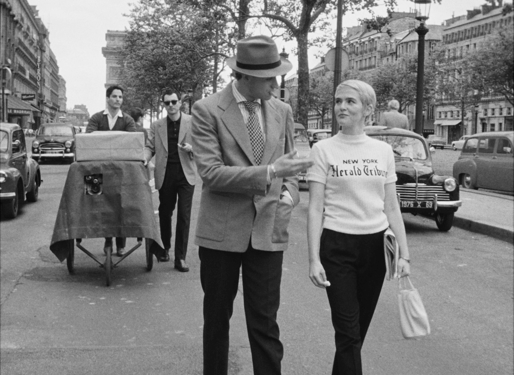
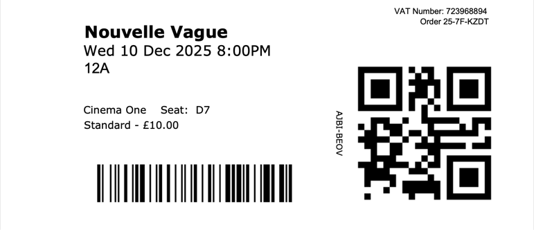





What a beautiful film. It was made in 2025 but feels exactly like it was shot in 1960 — like a documentary of the making of Breathless. In black and white of course, but it goes further than that. It's a deep attention to all the details.

I can't wait to watch Breathless again and then Nouvelle Vague again. The resemblence and style of Zoey Deutch and Aubry Dullin to Jean Seberg and Jean-Paul Belmondo is uncanny.

_Seberg and Belmondo in 1960_

_Deutch and Dullin in 2025_

There's a good [behind the scenes writeup](https://www.netflix.com/tudum/articles/nouvelle-vague-behind-the-scenes) on Netflix.

<section class="ticket-stub">
  <a href="https://www.dca.org.uk/">
    DCA
    
  </a>
</section>



