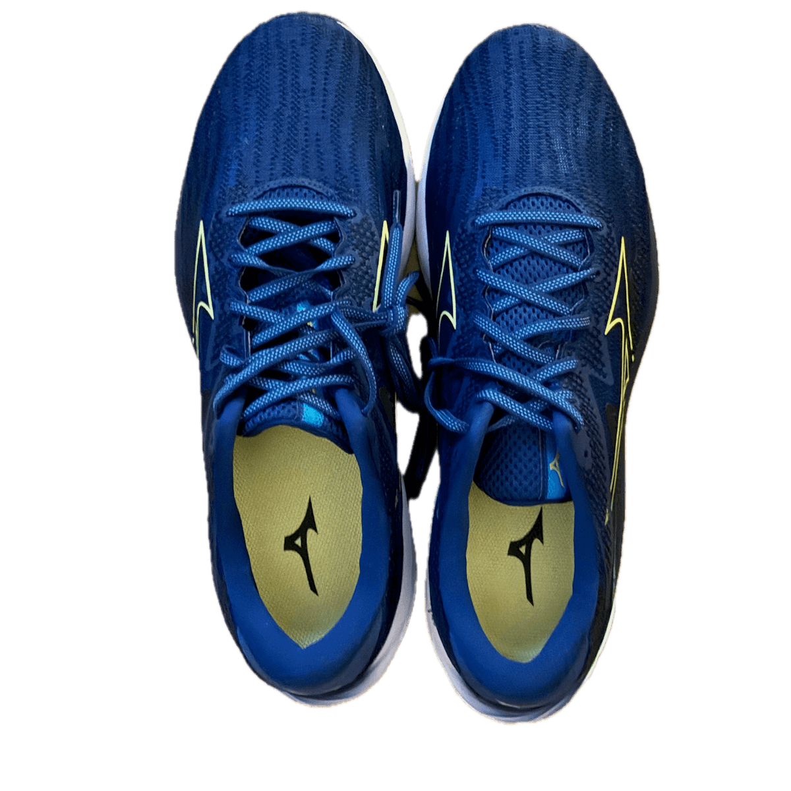

I look to [Strava](https://www.strava.com/athletes/5349071) as the primary source for all my running data but I only joined Strava on 23 June 2014 and my brain is almost forgetting (has forgotten?) stuff I did before that. This is an attempt to remember and a work-in-progress.

  

## Marathons

I've run two different marathons:

- [The Dramathon](https://www.thedramathon.com/) along the river Spey four times
- [Edinburgh](https://www.edinburghmarathon.com/) three times

They are very different races. The Dramathon is mostly on trails and has a few hills, including a big one at halfway and a long, steady climb to the finish. The scenery is beautiful. I think there are about 500 marathon runners so you're never far from someone but it's not crowded. You run past numerous distilleries and are handed about 8 minutures of whisky when you cross the finish line. There are very few spectators.

Edinburgh is all paved, closed roads and over 10,000 marathon runners. Crowded to start with but it soon stretches out. There's a lot of spectator support which is motivating. Starting off in the centre of Edinburgh, through the suburbs and then down and along the coast.

### ~~Dramathon 2017~~

Did Not Start due to training too hard too late. I got what I thought was a stress fracture in my shin but turned out just to be bruising (which does not sound as dramatic). It took me about six months to get running again. Lessons learned: 1) gradually increase volume over a long time; and 2) I need to be stronger (you can't rely just on running to train to be a runner). I definitely learned that first lesson but I continue to re-learn the second one.

### #1 Dramathon 2018

20 October 2018, [5:25:19](dramathon-2018.pdf) (aged 51)

My first marathon and one for which I didn't train enough. I was under the impression that the second half would be slightly harder than the first half and that I could just grit my teeth and it would all be fine. I don't have any splits but I think the second half took a whole hour longer than the first half. I was "running" at a walking pace by the finish. Drove 2 hours home without warming down or stretching and could barely walk for about a day.

### #2 Dramathon 2019

19 October 2019, [4:38:53](dramathon-2019.pdf) (aged 52)

My second marathon and I trained better for this one. Improved by around 47 minutes.

### #3 Edinburgh 2022 (aged 55)

29 May 2022, [4:28:19](https://www.myrunning.uk/emf-marathon-2022/results-stats?entry_id=1201689&race_number=10809&people_id=674652)

My 3rd marathon. Ran with George all the way. A PB by more than 10 minutes, but Edinburgh is a fast course. Too hot. Race number 10809. 

- 10k: 57:14
- Half: 2:06:55
- 30k: 3:04:00

### #4 Dramathon 2022

15 October 2022, [4:52:52](dramathon-2022.pdf) (aged 55)

My 4th marathon. Ran with George but he left me at 30k and easily beat me. Not a disaster but not as good as I'd hoped.

### ~~Edinburgh 2023~~

Did Not Start due to a toe injury. I [raised £110](https://www.justgiving.com/fundraising/bill-runs-edinburgh-marathon-2023) for Macmillan Cancer Support before I pulled out though. 

### ~~Dramathon 2023~~

Cancelled due to extreme weather (the route was flooded).

### #5 Edinburgh 2024

26 May 2024, [4:29:09](https://www.myrunning.uk/emf-marathon-2024/results-stats?entry_id=1388686&race_number=12968) (aged 57)

My 5th marathon. Not a PB but definitely a victory for pacing. 6 minutes slower at halfway than 2022 before but only 50 seconds slower overall. My plan was to not push it until 30k (18.5 miles) and then slowly wind up. In hindsight, I think I could have pushed _slightly_ harder from 25k onwards. For the first time, I was able to walk like a normal human the mile back to the car. I [raised £412](https://www.justgiving.com/page/bill-runs-edinburgh-marathon-2024) for Macmillan Cancer Support. Race number 12968.

- 10k: 1:00:57
- Half: 2:12:31
- 30k: 3:11:16. 

### #6 Dramathon 2024

19 October 2024, [4:40:31](dramathon-2024.pdf) (aged 57)

My 6th marathon. A little slower than Dramathon 2022 but I felt good. Ran with George until about 30k then went on ahead (his training had not gone as well as mine). Finished feeling good and managed a proper warm down. Did a 7k run 4 days later and felt good.

### #7 Edinburgh 2025

25 May 2025 [4:43:29](https://www.myrunning.uk/emf-marathon-2025/results-stats?entry_id=1605970&race_number=12047&people_id=674652) (aged 58)

That was a hard one. I did the first half at around the same pace as last year but my heart rate was 5 - 10 bpm higher, which was a bad sign. My ego wouldn't let me slow down to a pace that I knew I could sustain. Ended up doing the second half 11 minutes slower than the first half, slowing down considerably from 37k (23 miles) onwards. The 20mph headwind for the last 12k (7.5 miles) didn't help! Very pleased to have finished.

I've [raised £1,080](https://www.justgiving.com/page/bill-runs-edinburgh-marathon-2025) for Macmillan Cancer Support so far. 

### Dramathon 2025

18 October 2025 &hellip;

## Parkruns

I started running Parkrun in 2019 at Camperdown, Dundee. I defer to [Parkrun](https://www.parkrun.org.uk/parkrunner/6253485/) for up to date stats. My PB is currently [23:39](https://www.parkrun.org.uk/forfarloch/results/152/) on 5 April 2025 at Forfar.

## Long and distant past

### TC10k 2011

10k: 1 May 2011, [48:36](https://sportstats.one/results/38792) (aged 44)

Tracked this result down online. I think I could get within a minute or two of this time now but this might be a PB I won't beat. This is a flatish run in Victoria, British Columbia (where we were living at the time). 

### Two Breweries Hill Race 2005

30k: 2005

The [Two Breweries Hill Race](https://twobreweries.org.uk/) is a gruelling 30k trail race with 1500m of ascent. I ran this with the legendary Graham Kelly, in preparation for the KIMM later in the year. It's a long old race and Graham was very patient at my slow pace. It took well over 4 hours. Can't find any results. 

### KIMM 2005

Medium Score: 5 & 6 November 2005, [12:18:37](https://joelee.co.uk/2005/kimm/kimm05resm2.html)

A two day race, camping overnight and carrying all your equipment and food (now called the [OMM](https://theomm.com/the-omm/)). I raced this with Graham Kelly. The results are hard to understand but we got round. Again, Graham was nice enough to run at my slow pace. The main things I remember were: it was **very** wet (jumping in nearby Ullswater would not have made us any wetter); we each took a dram with us which was very welcome; I tried out a balloon bed for ultimate lightness and comfort and it sort of worked.

### Robin Hood Half Marathon 1991

21.1k: 1991, 1:38 (aged 24)

I don't imagine the results for this exist anywhere, let alone online. My mind only dimly remembers this race but I do remember being handed a Melton Mowbray pork pie at the finish (they were sponsors). I think my time was 1:38 but I could be wrong. It means a pace of 4:39/km which sounds possible. I was a very fit canoeist back then but didn't run much.
