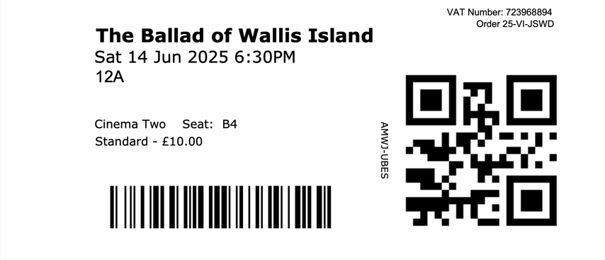





Funny and touching, I loved this. Lots of laugh out loud writing but in a very human way. Sweet but not saccharine. I would defintely see this again.

Sian Clifford as Amanda was perfect. Tim Key really nails some subtle mannerisms, like arranging his hair each time he goes into the shop to see her. 

Carey Mulligan and Tom Basden make a convincing musical duo. Kudos to Basden for the song writing. 

Trying to dry Herb's phone throughout the film was a long running gag. Rice pudding!

<section class="ticket-stub">
  <a href="https://www.dca.org.uk/">
    DCA
    
  </a>
</section>



