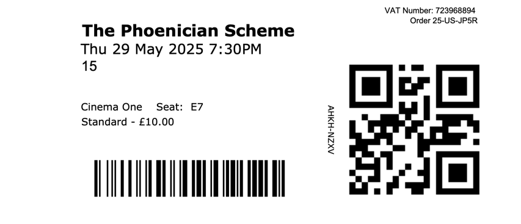



### ⭐⭐⭐⭐⭐

Very Wes!, very stylish, impeccably done. Mia Threapleton was my favourite among a strong cast. The plot seemed almost incidental — more a series of scenes, all precisely and well written. I also liked Michael Cera's _Bjorn Lund_, especially the bit where one of his paint brushes was ever so slightly bent after a plane crash. I love all that detail. 

It's very innovative but at the same time, more of the same. If you haven't watched a Wes Anderson film before then I'd  recommend you start elsewhere: [Fantastic Mr. Fox](/bill/films/fantastic-mr-fox-2009), [The Grand Budapest Hotel](/bill/films/the-grand-budapest-hotel-2014), [The French Dispatch](/bill/films/the-french-dispatch-2021) or [Asteroid City](/bill/films/asteroid-city-2023) — all of which make my [Top 100](/bill/films).

<section class="ticket-stub">
  <a href="https://www.dca.org.uk/">
    DCA
    
  </a>
</section>


