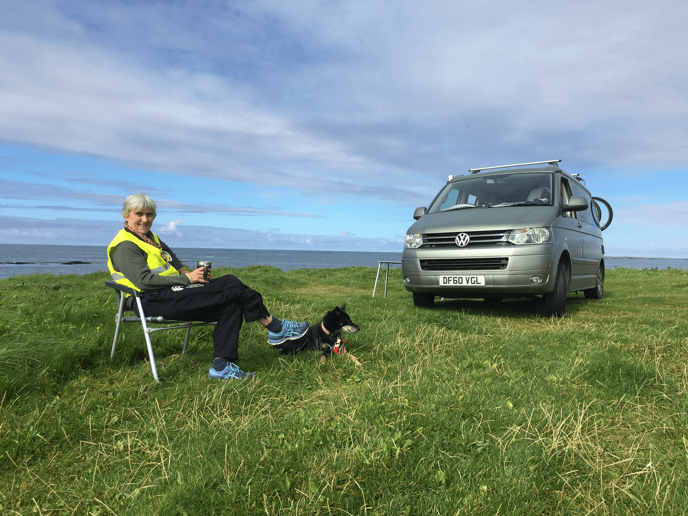
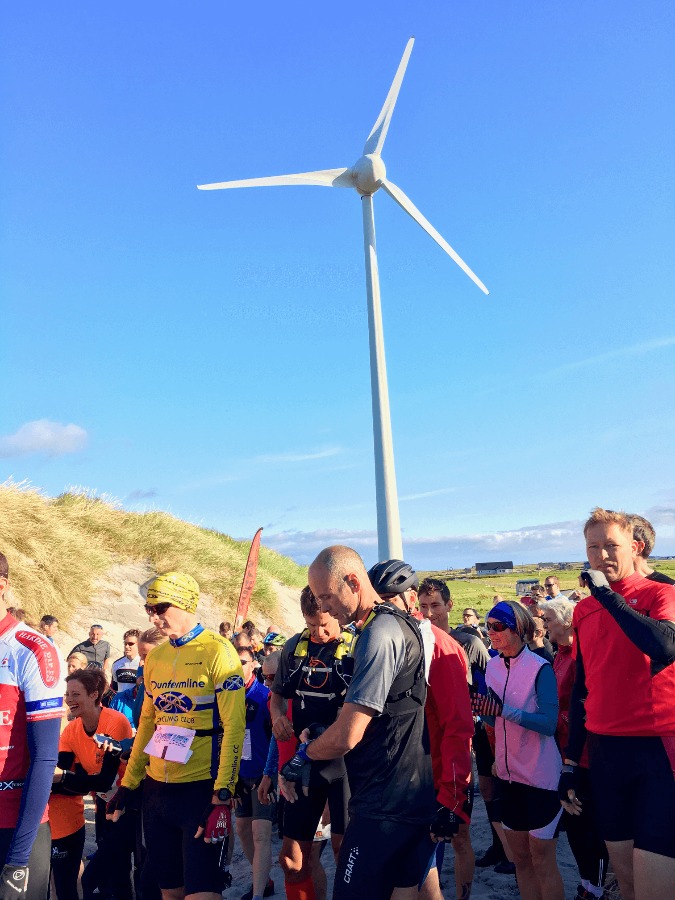
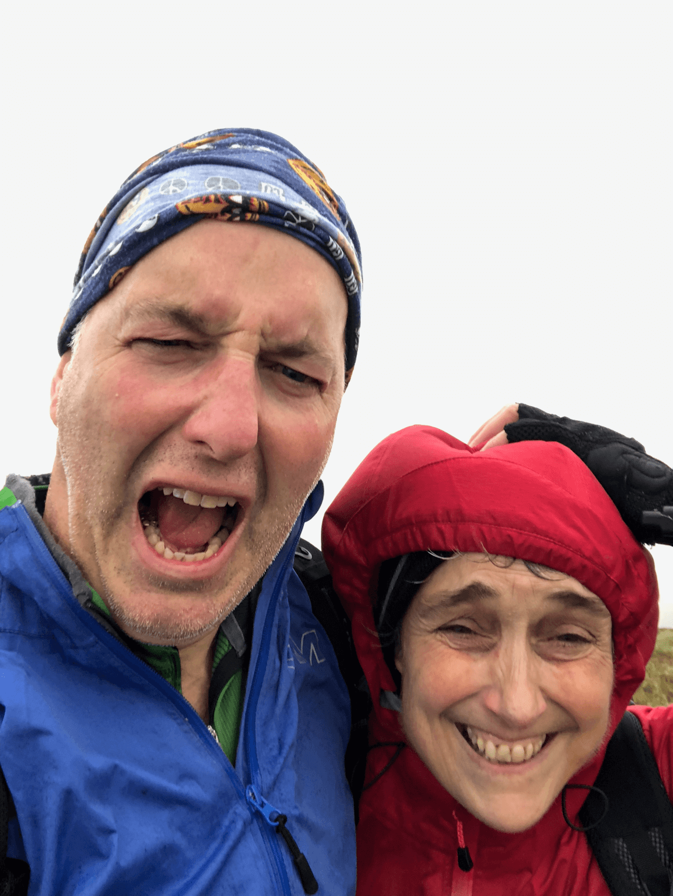
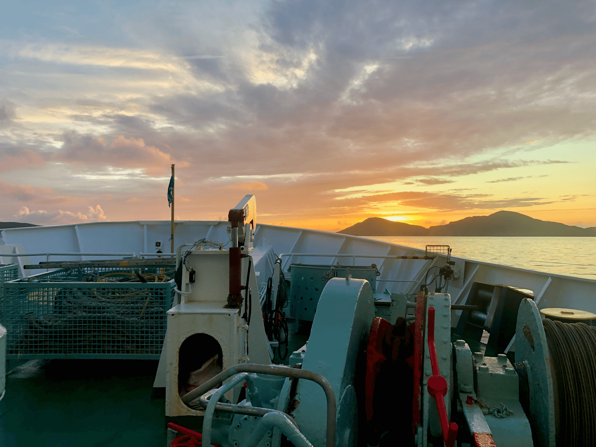
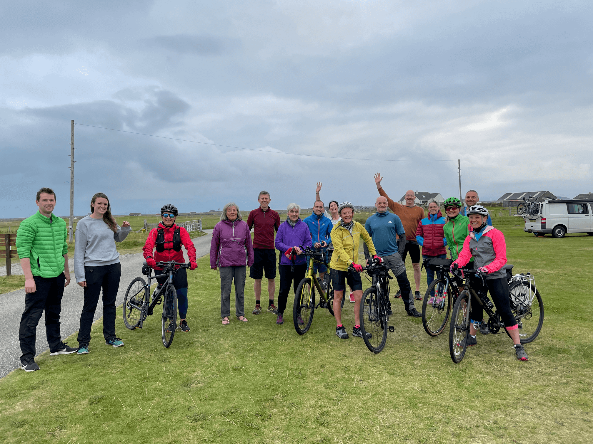
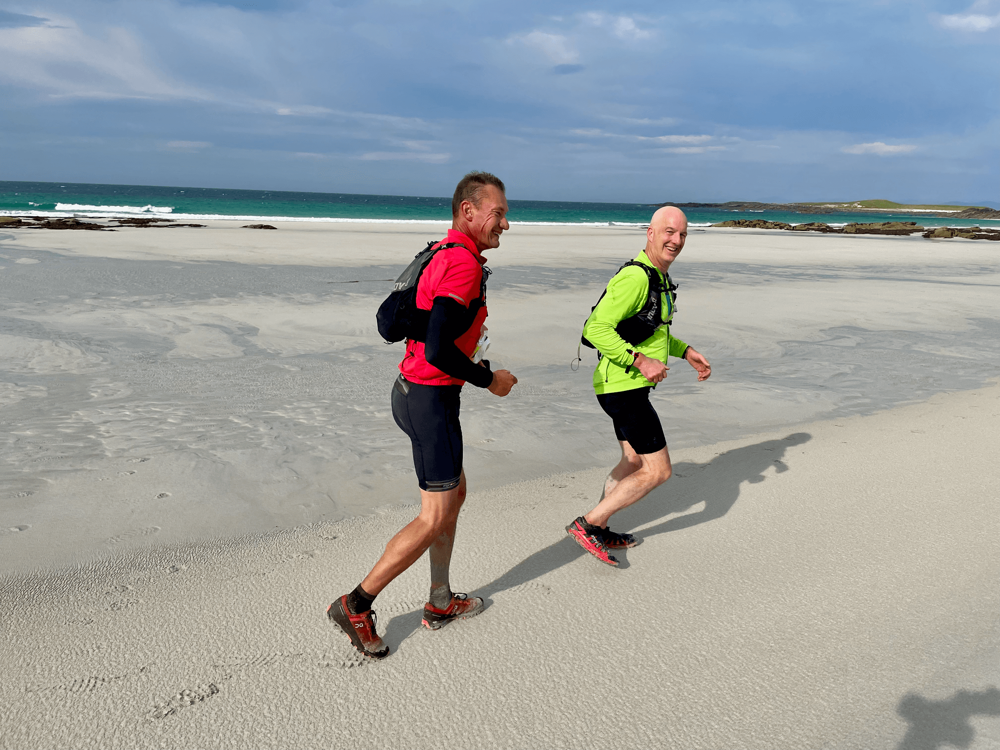

The Heb was born out of the ashes of the Hebridean Challenge which stopped in 2008, if I remember correctly. It was a simplified 2-day race instead of the complex and expensive 5-day Hebridean Challenge. Based on the Uists on the Outer Hebrides it ran from 2016 to 2022 (except for 2020 and 2021). It's a combination of biking, running and kayaking covering 200km in two days.

This is a record of my four years of racing (and one marshalling).

## 2016

Nonie and I marshalled because we were curious about the race. Had a great time and resolved to come back and race it the next year.

*Nonie on marshalling duties.*

## 2017

2—3 September 2017

Nonie and I raced. I came 34th with a total of 26:16:53 (includes time penalties). The winning time was 14:32:26! [Results](2017.pdf)

*The race always starts at the wind turbine beside Lionacleit school.*

## 2018

1—2 September 2018

Nonie and I raced again. I came 26th with a total of 24:37:38. Winning time was 13:24:36. [Results](2018.pdf)

The weather was rainy and windy. 50 mph headwinds on the bike meant that, even on the flat, if you stopped pedalling you came to a halt within seconds. The bike along the beach section was particularly gruelling: 12km of cycling at walking pace. Memorable for sure.

*Nonie and Bill atop the final hill, soaking wet and getting battered by the wind.*

## 2019

31 August—1 September 2019

Nonie and I raced again and convinced some friends to join us: Colin Thompson, Steve Hunt, Russell Rowlands, Jon Whitaker, and Sue Couling. I came 14th with a total of 25:02:10. [Results](2019.pdf)

*Approaching Lochboisdale on the ferry. Benn Mor and Hecla bathed in the sunset.*

## 2020

Cancelled due to COVID-19 restrictions.

## 2021

Cancelled due to ferry complications. Getting 150 people onto South Uist isn't an easy if they cancel a ferry and the tight schedule doesn't allow for any wiggle room. We ended up going out (on a different ferry) and completing most of the course for fun. With Sue Couling, Jon Whitaker, and George Horsman.

*The informal start to Not The Heb*

## 2022

I raced as a pair with Colin Thompson and we came 12th (first male pair) with 17:49:13. With George Horsman, Jon Whitaker, Steve Hunt, and Clive Richardson. [Results](2022.pdf)

*Colin and me running along the beach on the north side of Vallay, the tidal island off North Uist.*

There were rumours of a final race in 2026 but that is now looking unlikely. Seems like 2022 was the final one.
