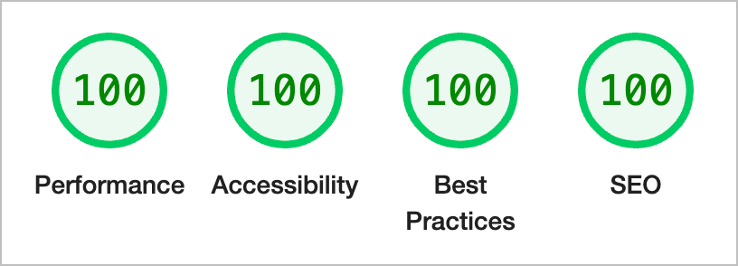

Having posted sporadically on Medium I thought I'd finally put my thoughts into my own space. I moved the [Logical Cobwebs](https://logicalcobwebs.com) website to Eleventy last week and while I'm on a roll&hellip;


## Eleventy

I started off with [Eleventy Blog template](https://github.com/11ty/eleventy-base-blog) which not only saves you time but it demonstrates a lot of techniques. There's some solid CSS included but my approach was to start from scratch and pull in bits that I wanted.

## Lighthouse

I love that, out of the box, the blog template includes the [Lighthouse](https://developer.chrome.com/docs/lighthouse/) plugin which tests [performance](https://developer.chrome.com/docs/lighthouse/performance/), [accessibility](https://developer.chrome.com/docs/lighthouse/accessibility/), [best practices](https://developer.chrome.com/docs/lighthouse/best-practices/) and [SEO](https://developer.chrome.com/docs/lighthouse/seo/). If you're not 100% on all those then the deploy fails! You can override that if you really want.



## Docker

I wanted to be able to run this website easily on my Mac so I set up [Docker](https://www.docker.com/).

This is my `Dockerfile`. Not much going on here:

1. Use an image providing Node 18
2. Copy over the app
3. Install the packages
4. Tell it to run on port 8082

```rb
FROM node:18.15-bullseye

RUN mkdir -p /app
WORKDIR /app

COPY . /app/
RUN npm install

EXPOSE 8082

CMD [ "npx", "@11ty/eleventy", "--serve", "--port=8082" ]
```

We're using [Traefik](https://traefik.io/) as a load balancer which makes things easy (even though we don't really need it). Here's the `docker-compose.yml` file:


```yml
version: "3.7"

services:

  lb:
    image: traefik:v2.9
    command:
      - --providers.docker
    ports:
      - 80:80
    volumes:
      - /var/run/docker.sock:/var/run/docker.sock

  web:
    build:
      context: .
      dockerfile: Dockerfile
    labels:
      - traefik.http.routers.whoami.rule=Host("dev.logicalcobwebs.com")"
    depends_on:
      - lb
    container_name: logicalcobwebs
    restart: always
    volumes:
      - ./:/app:cached
    ports:
      - 8082:8082

volumes:
  logicalcobwebs-app:
```

And now it's just

```sh
docker-compose up web
```

And with `dev.logicalcobwebs.com` pointing to `127.0.0.1` I'm all set to go with it running at http://dev.logicalcobwebs.com (note: that website isn't available on the Internet, it's just on my machine).

## Let's Encrypt!

But we can do more! Let's get SSL working automatically by asking [Let's Encrypt](https://letsencrypt.org/) to generate the SSL certificate using a DNS challenge from [DNSimple](https://dnsimple.com).


```yml
version: "3.7"

services:

  lb:
    image: traefik:v2.9
    environment:
      - DNSIMPLE_OAUTH_TOKEN
      - DNSIMPLE_BASE_URL
    command:
      - --providers.docker
      - --entrypoints.http.address=:80
      - --entrypoints.https.address=:443
      - --api.insecure=true
      - --certificatesresolvers.letsencrypt.acme.dnsChallenge=true
      - --certificatesresolvers.letsencrypt.acme.dnsChallenge.provider=dnsimple
      - --certificatesresolvers.letsencrypt.acme.dnsChallenge.delayBeforeCheck=0
      - --certificatesresolvers.letsencrypt.acme.email=${EMAIL}
      - --certificatesresolvers.letsencrypt.acme.storage=/letsencrypt/acme.json
    labels:
      - traefik.http.routers.to-https.rule=HostRegexp(`{host:.+}`)
      - traefik.http.routers.to-https.entrypoints=http
      - traefik.http.routers.to-https.middlewares=to-https
      - traefik.http.routers.traefik.rule=Host(`traefik.${DOMAIN}`)
      - traefik.http.routers.traefik.entrypoints=https
      - traefik.http.routers.traefik.service=api@internal
      - traefik.http.routers.traefik.tls=true
      - traefik.http.routers.traefik.tls.certresolver=${CERT_RESOLVER}
      - traefik.http.middlewares.to-https.redirectscheme.scheme=https

    ports:
      - 80:80
      - 8080:8080
      - 443:443
    volumes:
      - ./data/letsencrypt:/letsencrypt
      - /var/run/docker.sock:/var/run/docker.sock

  web:
    build:
      context: .
      dockerfile: Dockerfile
    labels:
      - traefik.http.routers.https.rule=Host(`${DOMAIN}`)
      - traefik.http.routers.https.entrypoints=https
      - traefik.http.routers.https.tls=true
      - traefik.http.routers.https.tls.certresolver=${CERT_RESOLVER}
    depends_on:
      - lb
    container_name: logicalcobwebs
    restart: always
    volumes:
      - ./:/app:cached
    ports:
      - 8082:8082

volumes:
  logicalcobwebs-app:
```

Finally, a `.env` file like this. You need to get `DNSIMPLE_OAUTH_TOKEN` from your DNSimple account settings, not from your user settings.

```txt
DOMAIN=dev.logicalcobwebs.com
EMAIL=
CERT_RESOLVER=letsencrypt
DNSIMPLE_BASE_URL=https://api.dnsimple.com
DNSIMPLE_OAUTH_TOKEN=
```

Now we can use https://dev.logicalcobwebs.com.
