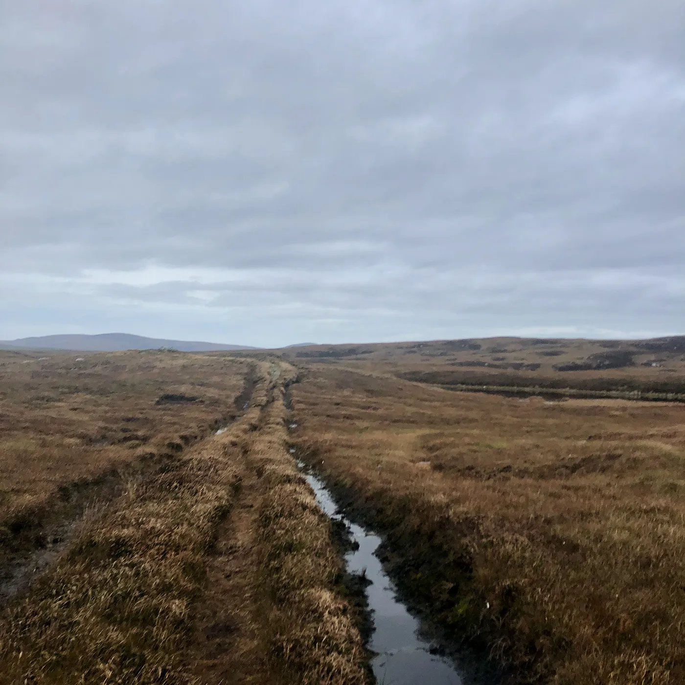
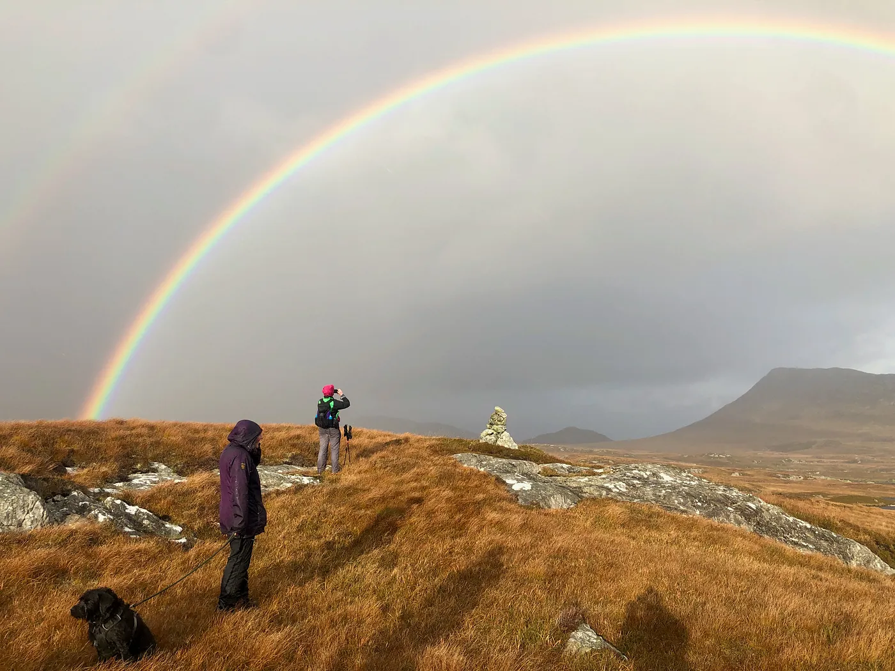
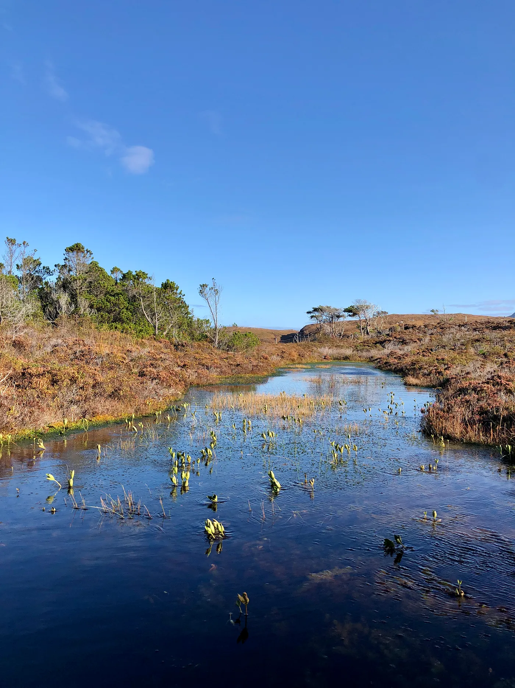
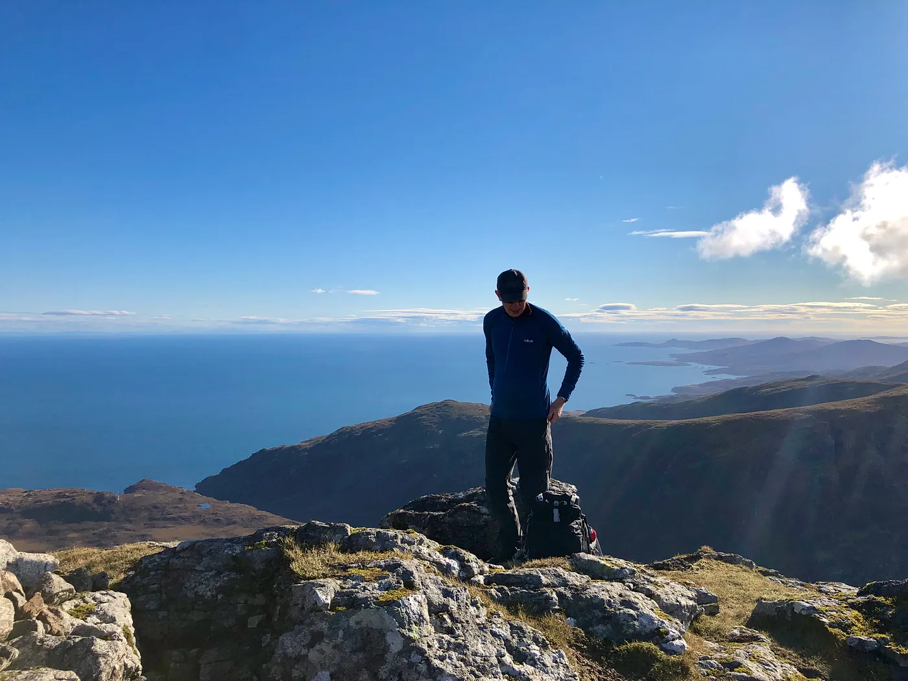
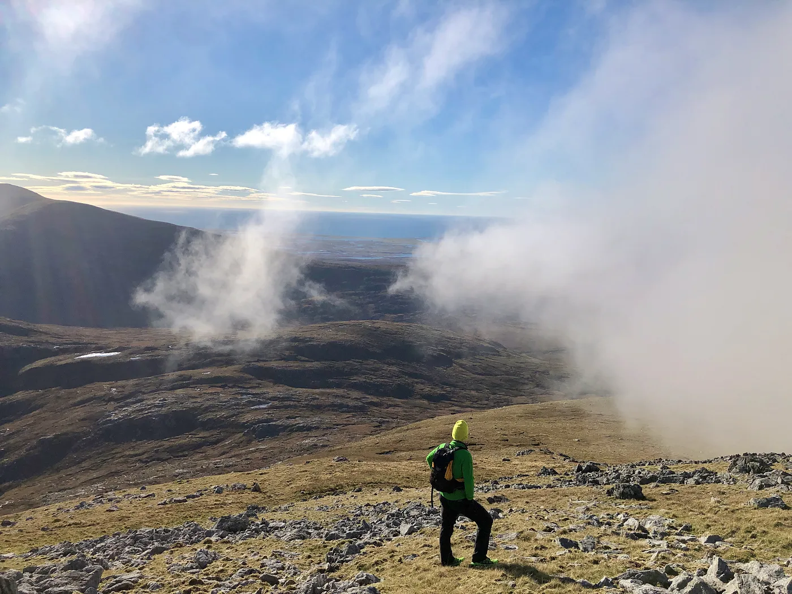
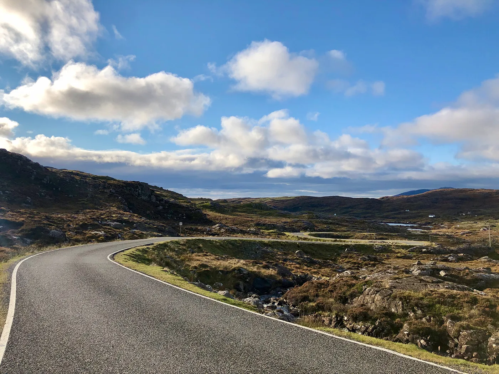
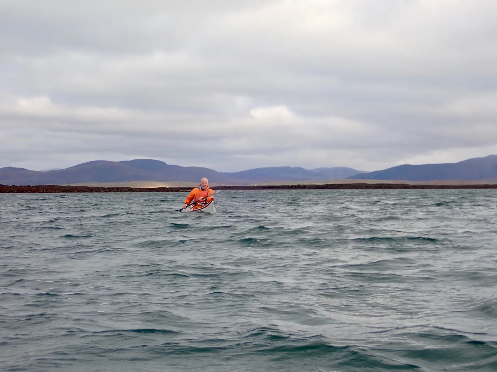

The Heb — Race on the Edge was due to run on 12–13 September 2020 but was postponed to May 2021 due to Coronavirus. So we went there on holiday to spend some time doing some of the sections at a more leisurely pace instead.

We got the boat from Uig on Skye to Lochmaddy on North Uist on Sunday morning. We spent four nights at Balranald, nipped over to Harris for two nights at Pairc Niseaboist, then back to Balranald for one more night.

## Sunday 11 October — Eaval
*Run: 9.6km, 1 hour*

George and I decided to run the off-road bike section from south to north. It’s just under 10km and a lot easier to run than it is to bike. We started in Carinish (NF821605) and ran north to Beinn Langais forest (NF844659).

*Hebridean Way (photo: George Horsman)*

*George*

*A lot of the track looks like this.*

## Monday 12 October — Eaval
*Hike: 13.1km, 4 hours 51 minutes*

This was the first big run section from 2019, although we were doing it as a group walk today. Starting at Charanis (NF855589) we headed east across the lochen strewn landscape and up the small but harsh hill of Eaval (NF899605). It’s a 4km walk-in across peaty, boggy terrain where you have to weave between sea lochs and freshwater lochens. It looks flat on the map but you’re constantly going up and down a few metres so it doesn’t feel it. There are no proper trails.

Once you get to Eaval it starts climbing steeply. The summit was just cloud free but the wind was howling and driving the rain/hail at us hard. We came back down pretty quickly.

*The sun came out as we looked back at Eaval*

## Tuesday 13 October — Loch Druidibeag

A leisurely day strolling round the 5km nature walk at the [RSPB nature reserve](https://www.visitscotland.com/info/see-do/rspb-scotland-loch-druidibeg-nature-reserve-p333721).

*Loch Hamascleit*

And then a birthday swim for George down at Bun na Feathlach (NF744355) — for a bet. He claimed to have enjoyed it, but it was only about a 3 second swim so I reckon it was pretty cold.

## Wednesday 14 October — Hecla
*Hike: 14.6km, 6 hours 9 minutes, 616m elevation gain*

Hecla summit has eluded me on about five attempts. The closest I got was the 2019 Heb race where I got to the halfway checkpoint. Weather permitting, I reckon it’s doable next May — the complication being the cut-off back at the road so you only really get about 4 hours to do it.

Like Eaval, the flat approach is punishing so although it’s only a few kilometres it’s slow going. The ascent itself is nice. It’s not even 2,000 feet but exhausting.

*Jon on the summit of Hecla, looking east*

<iframe width="560" height="315" src="https://www.youtube.com/embed/lmtZXzMexzQ" title="YouTube video player" frameborder="0" allow="accelerometer; autoplay; clipboard-write; encrypted-media; gyroscope; picture-in-picture; web-share" referrerpolicy="strict-origin-when-cross-origin" allowfullscreen></iframe>

*George looking west*

## Thursday 15 October — Out to Vallay
Bike: 10.4km, 1 hour 31 minutes

Across the sands at low tide to the tidal island of Vallay.

*Cycling across to Vallay*

## Friday 16 October — Harris Biking
_Bike: 47.1km, 2 hours 16 minutes, 632m elevation gain_

Starting from the [West Harris Trust](https://www.westharristrust.org/camping/) campervan ground at Pairc Niseaboist, we went clockwise up towards Tarbet and then back down the [Golden Road](https://www.virtualheb.co.uk/golden-road-isle-of-harris-western-isles/) towards Leverburgh. Probably the best road bike I’ve ever done.

*Short, twisty descents*

<iframe width="560" height="315" src="https://www.youtube.com/embed/-hCaPD2lZcg" title="YouTube video player" frameborder="0" allow="accelerometer; autoplay; clipboard-write; encrypted-media; gyroscope; picture-in-picture; web-share" referrerpolicy="strict-origin-when-cross-origin" allowfullscreen></iframe>

In the afternoon, the rest of the team went kayaking over to Taransay for a poke about.

*Sue and Jon’s kayaks artfully beached on Taransay (photo: Jon Whitaker)*

## Saturday 17 October
_Sea kayak: 12.1km, 2 hours 5 minutes_

From Leverburgh, Harris to Berneray.

*Bill with Harris in the background (photo: Sue Whitaker)*

<iframe width="560" height="315" src="https://www.youtube.com/embed/li6G3xRcFRU" title="YouTube video player" frameborder="0" allow="accelerometer; autoplay; clipboard-write; encrypted-media; gyroscope; picture-in-picture; web-share" referrerpolicy="strict-origin-when-cross-origin" allowfullscreen></iframe>
